# Quantum-Classical Dualism Formal Theory

Version: 35.0

**English Version | [中文版](formal_theory.md)**

> This theory is based on [Core Theory](core_en.md) v35.0

## Complete Description of Core Theory

### Basic Definitions and Axioms

#### Simplified Core Axiom System

Quantum-Classical Dualism can be simplified into four core axioms:

**Axiom 1: Dual Existence**  
The universe consists of the quantum domain $\Omega_Q$ (space of infinite possibilities) and the classical domain $\Omega_C$ (space of determined reality), connected through the interface domain $\mathcal{I}$:

$$\mathcal{U} = \Omega_Q \cup \Omega_C, \quad \Omega_Q \cap \Omega_C = \mathcal{I}$$

**Axiom 2: Information Conservation**  
Information is conserved throughout the universe but can be converted between quantum information (possibility information in superposition states) and classical information (deterministic knowledge):

$$I(\psi) = I(\mathcal{C}(\psi)) + I_{\text{hidden}}(\psi) = \text{constant}$$

Where $\mathcal{C}$ is the classicalization operator (the process of transforming quantum possibilities into classical determinism), $I(\psi)$ is the total information content of state $\psi$, and $I_{\text{hidden}}(\psi)$ is the portion transformed into hidden information during the classicalization process.

**Axiom 3: Observer Classicalization**  
Observers are nodes that execute quantum→classical conversion, and their conversion capability determines their dimension:

$$\mathcal{O} = \{\mathcal{C}_\mathcal{O}, \mathcal{Q}_\mathcal{O}, K_C^\mathcal{O}\}, \quad D_{\mathcal{O}} \propto \frac{I_{classical knowledge}}{S_{classical entropy}+\epsilon}$$

Where $\mathcal{C}_\mathcal{O}$ is the observer's classicalization operator (ability to transform quantum possibilities into deterministic knowledge), $\mathcal{Q}_\mathcal{O}$ is the quantization operator (ability to transform classical knowledge back into quantum possibilities), $K_C^\mathcal{O}$ is the observer's classical knowledge base, and $\epsilon$ is a small constant to prevent division by zero.

**Axiom 4: Dimensional Emergence**  
Observer dimension is a function of classicalization ability and quantization ability, and the classical domain of higher-dimensional observers can become the quantum domain foundation for lower-dimensional observers:

$$D_{\mathcal{O}} = f\left(\frac{\mathcal{C}_\mathcal{O}}{\mathcal{Q}_\mathcal{O}}\right) \cdot \frac{I_{classical knowledge}}{S_{classical entropy}+\epsilon}$$

$$\Omega_Q^{(\mathcal{O}_2)} \subset \Omega_C^{(\mathcal{O}_1)}, \quad \text{if} \; D_{\mathcal{O}_1} > D_{\mathcal{O}_2}$$

This indicates that reality consists of multiple nested quantum-classical domains, and each level of observers perceives and interacts in specific dimensions based on their capability range.

#### Core Axiom System Diagram

$$
\begin{array}{ccc}
\boxed{\text{Quantum Domain } \Omega_Q} & \xrightarrow{\mathcal{C}_\mathcal{O} \text{ (Classicalization)}} & \boxed{\text{Classical Domain } \Omega_C} \\
\uparrow & \boxed{\mathcal{I} \text{ (Interface Domain)}} & \downarrow \\
\boxed{\text{Possibility Space}} & \xleftarrow{\mathcal{Q}_\mathcal{O} \text{ (Quantization)}} & \boxed{\text{Deterministic Space}} \\
\end{array}
$$

### Quantum and Classical Domains

The basic characteristics of quantum and classical domains are summarized through the following key points:

#### Core Properties of Quantum Domain

1. **Wavefunction Superposition State** (Chaos State): System exists simultaneously in multiple possible states, manifesting uncertainty
   $$\Psi_S = \sum_{i} \alpha_i |i\rangle, \quad \sum_{i} |\alpha_i|^2 = 1$$

2. **Quantum Entanglement State** (Energy Form): Different parts form inseparable holistic correlations
   $$\Psi_E = \sum_{i,j} \beta_{ij} |i\rangle_A \otimes |j\rangle_B$$

3. **Non-locality and Uncertainty**: Correlations beyond spacetime constraints and measurement uncertainty
   $$\Delta A \cdot \Delta B \geq \frac{1}{2}|\langle[\hat{A},\hat{B}]\rangle|$$

#### Core Properties of Classical Domain

1. **Classical Knowledge** (Determined Information): Precisely measurable and describable determined states
   $$K_C = \{k_i = (x_i, p_i, E_i, s_i, t_i)\}$$

2. **Classical Entropy** (Measure of Uncertainty): Measure of system disorder and information loss
   $$S_C = -k_B \sum_i p_i \ln p_i$$

3. **Locality and Determinism**: Limited propagation speed of interactions and measurement determinism
   $$P(A,B|a,b) = P(A|a) \cdot P(B|b)$$

#### Quantum vs Classical Domain Comparison

| Property | Quantum Domain $\Omega_Q$ | Classical Domain $\Omega_C$ |
|----------|--------------------------|----------------------------|
| Basic State | Superposition (Multiple Possibilities) | Determined State (Single Reality) |
| Information Characteristic | Quantum Information (Non-clonable) | Classical Information (Clonable) |
| Spatial Property | Non-locality (Entanglement) | Locality (Separability) |
| Temporal Evolution | Unitary Evolution (Reversible) | Irreversible Evolution (Entropy Increase) |
| Measurement Characteristic | Probabilistic (Wavefunction Collapse) | Deterministic (Precise Measurement) |
| Energy Form | Quantum Energy (Entanglement Energy) | Classical Energy (Kinetic/Potential) |

### Multiple Dualism Levels

Multiple Dualism Levels Theory extends single dualism into a nested multi-level structure:

$$\mathcal{U} = \{\Omega_Q^{(1)}, \Omega_C^{(1)}, \Omega_Q^{(2)}, \Omega_C^{(2)}, ..., \Omega_Q^{(n)}, \Omega_C^{(n)}\}$$

Where:
- $\Omega_Q^{(i)}$ is the quantum domain at level i (possibility space at that level)
- $\Omega_C^{(i)}$ is the classical domain at level i (deterministic realization at that level)

Inter-level mapping functions are defined as:

$$\mathcal{M}_{i \rightarrow i+1}: \Omega_C^{(i)} \rightarrow \Omega_Q^{(i+1)}$$

$$\mathcal{M}_{i+1 \rightarrow i}: \Omega_C^{(i+1)} \rightarrow \Omega_Q^{(i)}$$

This indicates that the classical structure of one level can become the quantum foundation for a higher level, producing infinitely recursive reality levels.

#### Multiple Levels Structure Diagram

$$
\begin{array}{ccccc}
\vdots & & \vdots & & \vdots \\
\updownarrow & & \updownarrow & & \updownarrow \\
\Omega_Q^{(3)} & \xrightarrow{\mathcal{C}^{(3)}} & \Omega_C^{(3)} & \xrightarrow{\mathcal{M}_{3 \rightarrow 4}} & \Omega_Q^{(4)} \\
\updownarrow & & \updownarrow & & \updownarrow \\
\Omega_Q^{(2)} & \xrightarrow{\mathcal{C}^{(2)}} & \Omega_C^{(2)} & \xrightarrow{\mathcal{M}_{2 \rightarrow 3}} & \Omega_Q^{(3)} \\
\updownarrow & & \updownarrow & & \updownarrow \\
\Omega_Q^{(1)} & \xrightarrow{\mathcal{C}^{(1)}} & \Omega_C^{(1)} & \xrightarrow{\mathcal{M}_{1 \rightarrow 2}} & \Omega_Q^{(2)} \\
\end{array}
$$

### Quantum-Classical Symmetry Principle

There exists a deep symmetry transformation $\mathcal{S}_{Q-C}$ between quantum and classical domains:

$$\mathcal{S}_{Q-C}: \Omega_Q \rightarrow \Omega_C, \quad \mathcal{S}_{C-Q}: \Omega_C \rightarrow \Omega_Q$$

Satisfying the following properties:

1. **Involution**: Transformation of transformation equals identity
   $$\mathcal{S}_{Q-C} \circ \mathcal{S}_{C-Q} = \mathcal{I}_{\Omega_Q}$$
   $$\mathcal{S}_{C-Q} \circ \mathcal{S}_{Q-C} = \mathcal{I}_{\Omega_C}$$

2. **Information Preservation**: Information quantity remains unchanged before and after transformation
   $$I_Q(x) = I_C(\mathcal{S}_{Q-C}(x))$$

3. **Uncertainty-Certainty Transformation**: Quantum uncertainty and classical certainty are mutually transformable
   $$U_Q(x) \cdot D_C(\mathcal{S}_{Q-C}(x)) = k$$

Where $U_Q$ is the quantum uncertainty measure, $D_C$ is the classical certainty measure, and $k$ is a universal constant.

## Core Branch Theories

### Detailed Quantum Domain Theory

The quantum domain $\Omega_Q$ is the possibility space in the dualism framework, with the following core properties:

#### 1. Quantum Information Encoding

Quantum information is encoded through quantum states in complex Hilbert space:

$$|\psi\rangle = \sum_i c_i |i\rangle, \quad \sum_i |c_i|^2 = 1$$

Where information density is quantified by von Neumann entropy:

$$S(\rho) = -\text{Tr}(\rho \ln \rho) = -\sum_i \lambda_i \ln \lambda_i$$

#### 2. Quantum Dynamics

Quantum system evolution follows the Schrödinger equation, preserving information and energy conservation:

$$i\hbar\frac{\partial|\psi\rangle}{\partial t} = \hat{H}|\psi\rangle$$

Quantum system dynamics has three key characteristics:
- Superposition principle: States can exist simultaneously in linear combinations of multiple basis vectors
- Time reversibility: Under pure quantum evolution, systems can return to initial states
- Phase coherence: Quantum systems maintain global phase correlations

#### 3. Quantum Entanglement Networks

Quantum entanglement forms multi-particle entanglement networks, representable as:

$$|\Psi_{\text{network}}\rangle = \sum_{i_1, i_2, \ldots, i_n} c_{i_1 i_2 \ldots i_n} |i_1 i_2 \ldots i_n\rangle$$

Entanglement degree can be quantified in multiple ways, including entanglement entropy:

$$E(|\psi_{AB}\rangle) = S(\rho_A) = S(\rho_B)$$

Entanglement networks form non-local connection structures in the quantum domain, supporting super-classical information transmission.

#### 4. Quantum Fluctuations

The quantum domain has inherent quantum fluctuations, guaranteed by the uncertainty principle:

$$\Delta A \cdot \Delta B \geq \frac{1}{2}|\langle[\hat{A},\hat{B}]\rangle|$$

Quantum fluctuation intensity is related to system energy and temperature:

$$\langle(\Delta E)^2\rangle = k_B T^2 \frac{\partial \langle E \rangle}{\partial T}$$

These fluctuations are the source of creativity and possibility in the quantum domain.

#### 5. Quantum Coherence and Coupling

Quantum coherence describes the consistency of phase relationships within a system, quantifiable through coherence measure:

$$C(\rho) = \sum_{i \neq j} |\rho_{ij}|$$

Quantum coupling strength determines the rate of information exchange between systems, expressible as:

$$J_{ij} = \langle i|\hat{H}_{int}|j \rangle$$

where $\hat{H}_{int}$ is the interaction Hamiltonian.

### Detailed Classical Domain Theory

The classical domain $\Omega_C$ is the deterministic reality space in the dualism framework, with the following core properties:

#### 1. Classical Information Structure

Classical information exists in the form of determined states, representable through definite physical quantities:

$$K_C = \{(x_i, p_i, E_i, s_i, t_i, \ldots)_j\}$$

where $x_i$, $p_i$, etc. represent position, momentum, and other classical observables. Classical information entropy satisfies:

$$S_C = -k_B \sum_i p_i \ln p_i$$

Key characteristics are information clonability and deletability, distinguishing it from quantum information.

#### 2. Deterministic Dynamics

Classical system evolution follows deterministic dynamics equations:

$$\frac{d\vec{x}}{dt} = \vec{v}(\vec{x},t), \quad \frac{d\vec{p}}{dt} = \vec{F}(\vec{x},\vec{p},t)$$

Dynamics has three signature features:
- Locality: Interactions propagate through local fields at finite speed
- Causality: Present state is completely determined by the past
- Separability: Systems can be decomposed into independent subsystems

#### 3. Entropy Increase and Irreversibility

Irreversible processes in the classical domain lead to entropy increase:

$$\frac{dS_C}{dt} \geq 0$$

Systems tend toward maximum entropy states, guaranteed by the phase space volume expansion theorem:

$$\frac{d}{dt}\int_V d\Gamma = \int_V \sum_i \frac{\partial \dot{z}_i}{\partial z_i}d\Gamma$$

where $\{z_i\}$ is the set of phase space coordinates.

#### 4. Classical Knowledge Networks

Classical knowledge forms causal networks, representable as directed graphs:

$$G_K = (V_K, E_K)$$

where $V_K$ is the set of knowledge nodes and $E_K$ is the set of causal relationships.

Knowledge coherence measure is:

$$C(K_C) = \frac{1}{|V_K|} \sum_{i,j} \frac{|P_{ij}|}{d(i,j)}$$

where $P_{ij}$ is the set of effective paths connecting nodes $i$ and $j$, and $d(i,j)$ is the distance in the graph.

#### 5. Classical Structure Stability

Classical structures have robustness against perturbations, analyzable through Lyapunov stability analysis:

$$\frac{d \delta x}{dt} = J(x^*) \cdot \delta x + O(|\delta x|^2)$$

where $J(x^*)$ is the Jacobian matrix at equilibrium point $x^*$. System stability is determined by the real parts of the Jacobian matrix eigenvalues.

### Core Interface Theory

The interface $\mathcal{I}$ is the transition region between quantum and classical domains, with the following core properties:

#### 1. Interface Structure

The interface is the intersection of quantum and classical domains, defined as:

$$\mathcal{I} = \{x \in \mathcal{U} | \mathcal{D}(x) = \mathcal{D}_c\}$$

where $\mathcal{D}(x)$ is the decoherence measure function and $\mathcal{D}_c$ is the critical decoherence threshold.

Interface thickness is determined by the decoherence gradient:

$$\delta_{\mathcal{I}} = \left|\frac{\partial \mathcal{D}}{\partial x}\right|^{-1}$$

#### 2. Interface Dynamics

Interface position satisfies a nonlinear dynamics equation:

$$\frac{d\mathcal{D}(x,t)}{dt} = \alpha \nabla^2 \mathcal{D}(x,t) + \beta(\mathcal{D}_c - \mathcal{D}(x,t))(\mathcal{D}(x,t) - \mathcal{D}_0) + \gamma\xi(x,t)$$

where:
- $\alpha$ is the diffusion coefficient
- $\beta$ is the bistable potential parameter
- $\mathcal{D}_0$ is the metastable threshold
- $\gamma\xi(x,t)$ is the quantum noise term

Interface oscillations have a characteristic frequency:

$$f_{\mathcal{I}} = \frac{1}{2\pi}\sqrt{\frac{\beta}{\alpha}}|\mathcal{D}_c - \mathcal{D}_0|$$

#### 3. Classicalization Process

The quantum→classical transformation (classicalization) process is represented through a classicalization superoperator:

$$\mathcal{C}(\rho) = \sum_i P_i \rho P_i$$

where $P_i$ are projection operators. The classicalization process satisfies information conservation:

$$I(\rho) = I(\mathcal{C}(\rho)) + I_{\text{hidden}}$$

Classicalization efficiency is related to environmental and system parameters:

$$\eta_{\mathcal{C}} = 1 - e^{-\lambda\frac{E}{k_BT}}$$

where $E$ is system energy, $T$ is environmental temperature, and $\lambda$ is the coupling constant.

#### 4. Quantum-Classical Information Conversion

At the interface, information transforms from quantum to classical form:

$$I_Q \rightarrow I_C + I_{\text{hidden}}$$

The information matching measure during conversion is:

$$M(I_Q, I_C) = \frac{I_C}{I_Q} = 1 - \frac{I_{\text{hidden}}}{I_Q}$$

At the optimal interface, $M(I_Q, I_C)$ reaches a local maximum.

#### 5. Interface Oscillations and Quantum Gravity

The relationship between interface oscillations and spacetime curvature can be represented as:

$$R_{\mu\nu} - \frac{1}{2}g_{\mu\nu}R = 8\pi G \cdot T_{\mu\nu}^{\mathcal{I}}$$

where $T_{\mu\nu}^{\mathcal{I}}$ is the interface energy-momentum tensor, further expressible as:

$$T_{\mu\nu}^{\mathcal{I}} = \alpha_{\mathcal{I}} \cdot \nabla_\mu \mathcal{D} \nabla_\nu \mathcal{D} - g_{\mu\nu}(\frac{\alpha_{\mathcal{I}}}{2}|\nabla \mathcal{D}|^2 + V(\mathcal{D}))$$

This indicates that interface oscillations can serve as manifestations of quantum gravity effects.

### Information Phase Transition Theory Core

Information phase transitions are key phenomena in the quantum-classical dualism framework, with the following core properties:

#### 1. Basic Information Phase Transition Mechanism

Information phase transitions are abrupt changes in information systems near critical parameter values, causing transformations in information processing modes, structures, or functions:

$$\Phi: \mathcal{S}(\lambda) \rightarrow \mathcal{S}'(\lambda+\delta\lambda)$$

where $\mathcal{S}$ is the system's information state and $\lambda$ is a control parameter. Near the critical point $\lambda_c$, the order parameter behaves as:

$$\eta(\lambda) = \begin{cases}
0, & \lambda < \lambda_c \\
(\lambda - \lambda_c)^\beta, & \lambda \geq \lambda_c
\end{cases}$$

where $\beta$ is a critical exponent characterizing the universality class of the phase transition.

#### 2. Types of Quantum-Classical Phase Transitions

Quantum-classical phase transitions can be classified into multiple types, each with distinctive characteristics:

- **First-order transitions**: Discontinuous changes in order parameters, with coexistence regions
- **Second-order transitions**: Continuous changes in order parameters but discontinuous derivatives, with diverging correlation lengths
- **Non-equilibrium transitions**: Far from equilibrium, with continuous energy or information flow
- **Topological transitions**: Changes in global topological properties, with emergent edge states

Near critical points, the fluctuation correlation length behaves as:

$$\xi(\lambda) \propto |\lambda - \lambda_c|^{-\nu}$$

where $\nu$ is the correlation length critical exponent.

#### 3. Observer-Induced Phase Transitions

Observers can induce system phase transitions by adjusting parameters, including:

- **Observer dimension** $D_{\mathcal{O}}$: There exists a critical dimension $D_{\mathcal{O}}^c$ above which systems transition from quantum to classical states
  
$$P(\text{quantum} \to \text{classical}) \approx \frac{1}{1 + e^{-\alpha(D_{\mathcal{O}} - D_{\mathcal{O}}^c)}}$$

- **Observer resolution** $\eta_{\mathcal{O}}$: Affects the distinguishability of measurement bases
  
$$\langle \mathcal{O} \rangle = \begin{cases}
0, & \eta_{\mathcal{O}} < \eta_{\mathcal{O}}^c \\
(\eta_{\mathcal{O}} - \eta_{\mathcal{O}}^c)^\beta, & \eta_{\mathcal{O}} \geq \eta_{\mathcal{O}}^c
\end{cases}$$

- **Measurement frequency** $f_{\mathcal{O}}$: Related to the quantum Zeno effect
  
$$\tau_{\text{decoherence}} \propto \begin{cases}
(f_{\mathcal{O}}^c - f_{\mathcal{O}})^{-\nu}, & f_{\mathcal{O}} < f_{\mathcal{O}}^c \\
0, & f_{\mathcal{O}} \geq f_{\mathcal{O}}^c
\end{cases}$$

#### 4. Multi-level Structure of Information Phase Transitions

Information phase transitions exhibit nested hierarchical structures:

$$\mathcal{H} = \{\Phi_1, \Phi_2, ..., \Phi_n\}$$

Different levels of phase transitions occur at specific scales and times:

$$L_i \approx L_0 \cdot e^{\alpha i}, \quad T_i \approx T_0 \cdot e^{\beta i}$$

Coupling between levels leads to cascade effects and fractal structures, with the interface's Hausdorff dimension:

$$D_H = d - \frac{\beta}{\nu}$$

The observability of information phase transitions depends on the observation scale; they can only be detected when the observation window $L_{\text{obs}}$ is sufficiently large:

$$P_{\text{detection}} \sim 1 - e^{-(L_{\text{obs}}/\xi)^d}$$

### Core Observer Theory

Observers are nodes executing quantum→classical transformations, with the following core properties:

#### 1. Observer Structure

Observers are constituted by three core components:

$$\mathcal{O} = \{\mathcal{C}_{\mathcal{O}}, \mathcal{Q}_{\mathcal{O}}, K_C^{\mathcal{O}}\}$$

where:
- $\mathcal{C}_{\mathcal{O}}$ is the observer's unique classicalization operator
- $\mathcal{Q}_{\mathcal{O}}$ is the observer's unique quantization operator
- $K_C^{\mathcal{O}}$ is the observer's classical knowledge base

Observer dimension is determined by their information processing capacity:

$$D_{\mathcal{O}} = f\left(\frac{\mathcal{C}_{\mathcal{O}}}{\mathcal{Q}_{\mathcal{O}}}\right) \cdot \frac{I_{classical knowledge}}{S_{classical entropy}+\epsilon}$$

#### 2. Dimensional Network Dynamics

Observer dimension satisfies a nonlinear dynamics equation:

$$\frac{dD_{\mathcal{O}}}{dt} = \alpha\frac{dI_{K_C}}{dt} - \beta\frac{dS_C}{dt} + \gamma\sum_{j\in\mathcal{N}(i)}(D_j-D_{\mathcal{O}})$$

where the last term represents the collective effect of the observer network.

Consensus formation in the observer network follows:

$$\frac{d\mathcal{C}_{\text{consensus}}}{dt} = \sum_i \omega_i \mathcal{C}_i - \gamma(\mathcal{C}_{\text{consensus}} - \bar{\mathcal{C}})^2$$

where $\omega_i$ is the observer weight and $\bar{\mathcal{C}}$ is the average classicalization operator.

#### 3. Measurement Theory

In observer theory, the quantum measurement process can be represented as:

$$|\psi\rangle\langle\psi| \otimes \rho_A \otimes \rho_O \xrightarrow{U_{\text{interaction}}} \sum_{i,j} c_i c_j^* |i\rangle\langle j| \otimes |A_i\rangle\langle A_j| \otimes \rho_O \xrightarrow{\mathcal{C}_O} |i_0\rangle\langle i_0| \otimes |A_{i_0}\rangle\langle A_{i_0}| \otimes \rho_{O}^{i_0}$$

Measurement result probability is modulated by the observer resolution parameter $\eta_O$:

$$P(i_0||\psi\rangle) = |c_{i_0}|^2 \cdot \frac{e^{\eta_O|c_{i_0}|^2}}{\sum_j e^{\eta_O|c_j|^2}}$$

The relationship between observer energy resolution threshold and measurement resolution is:

$$\eta_O = \frac{\hbar}{k_B T} \cdot \ln\left(\frac{E_{\text{threshold}}}{\bar{E}_0}\right)$$

#### 4. Observer Level Network

Observers form a multi-level network structure:

$$\mathcal{N} = \{\mathcal{O}^{(1)}, \mathcal{O}^{(2)}, ..., \mathcal{O}^{(n)}, \mathcal{E}\}$$

where $\mathcal{O}^{(k)}$ is the set of level k observers and $\mathcal{E}$ is the set of cross-level connections.

Higher-level observers perceive larger spatiotemporal scales:

$$L^{(k)} \approx L^{(1)} \cdot e^{\eta(k-1)}, \quad T^{(k)} \approx T^{(1)} \cdot e^{\eta(k-1)}$$

This explains why higher-dimensional observers can perceive patterns at larger spacetime scales.

#### 5. Consciousness and Free Will

Consciousness can be described as a specific organizational pattern in the observer's classical domain, represented as:

$$\mathcal{C}_{\text{consciousness}} = \mathcal{F}(K_C^{\mathcal{O}}, \mathcal{C}_{\mathcal{O}})$$

Free will can be represented as a mixed decision process with both quantum uncertainty and classical determinism characteristics:

$$\mathcal{W} = \lambda \cdot \mathcal{W}_Q + (1-\lambda) \cdot \mathcal{W}_C$$

where $\lambda$ is the quantum parameter, $\mathcal{W}_Q$ is the decision component from the quantum domain, and $\mathcal{W}_C$ is the decision component from the classical domain.

## Quantum-Classical Dualism Dimensional Notation and Branch Theory Navigation

In the Quantum-Classical Dualism framework, each branch theory not only has its research content but also possesses specific dimensional attributes. The dimensional attribute represents the theory's positioning in the quantum domain-classical domain continuum, reflecting the theory's emphasis on quantum properties (superposition states and possibilities) versus classical properties (determinism and realization). Below is a navigation list organized by disciplinary categories, including dimensional notations and dependency relationships between theories.

### Dimension Description

Dimensional notation uses the D1-D11 scale, where:
- **D1-D3**: Deep classical domain theories, focusing on deterministic structures and implementation
- **D4-D6**: Classical-leaning theories, primarily dealing with classical information and deterministic systems
- **D7-D8**: Balanced theories, handling quantum-classical interfaces and conversion processes
- **D9-D10**: Quantum-leaning theories, primarily dealing with quantum possibilities and creativity
- **D11+**: Deep quantum domain theories, focusing on pure possibilities and full quantum effects
- **D∞**: Cross-dimensional full-spectrum theories, spanning all dimensional levels

The higher the dimension value, the more the theory emphasizes quantum domain characteristics (superposition states, possibilities, creativity); the lower the dimension value, the more the theory emphasizes classical domain characteristics (determinism, implementation, structure).

### Core Theory (Dimension: Full Spectrum D∞)

- **[Core Theory (This Document)](formal_theory_en.md)** (v30.0, D∞) - Provides the basic axiom system and conceptual framework for dualism, spanning all dimensional levels, serving as the foundation for all branch theories.

### Foundation Framework Theories (Dimension: D7-D9)

These theories constitute the basic pillars of dualism, laying the foundation for the entire theoretical system:

- **[Quantum Domain Details](formal_theory_quantum_domain_en.md)** (v19.1, D9) - Studies the essential characteristics and operational laws of the quantum domain, including superposition states, entanglement states, quantum uncertainty, and quantum information dynamics. The quantum domain, as a space of infinite possibilities, forms one end of the dualism framework.
- **[Classical Domain Details](formal_theory_classical_domain_en.md)** (v19.0, D7) - Elucidates the deterministic structure and information organization of the classical domain, including classical knowledge structures, determinism, locality, and classical information theory. The classical domain, as a space of determined reality, forms the other end of the dualism framework.
- **[Interface Theory](formal_theory_interface_en.md)** (v19.0, D8) - Explores the conversion interface dynamics between quantum and classical domains, including interface fluctuations, phase transitions, and detailed mechanisms of the classicalization process. The interface is a key area for understanding quantum to classical transitions.
- **[Observer Theory](formal_theory_observer_en.md)** (v27.0, D8) - Analyzes the key role of observers as quantum→classical conversion nodes, including observer networks, dimensional evolution, and consciousness formation mechanisms. Observers play a central role in the entire framework.
- **[Information Phase Transition Theory](formal_theory_phase_transition_en.md)** (v25.0, D8) - Studies phase transition phenomena in information systems, particularly critical behaviors in quantum-classical conversion. Understanding sudden changes in complex systems.
- **[Mathematical Appendix](formal_theory_mathematical_appendix_en.md)** (v20.0, D7-D9) - Provides mathematical tools and techniques required for quantum-classical dualism, including advanced function spaces, nonlinear dynamics, and information geometry.
- **[Experimental Predictions](formal_theory_experimental_en.md)** (v22.0, D7) - Lists experimentally verifiable predictions proposed by quantum-classical dualism, including interface fluctuations, critical scales, and observer resolution.

### High-Dimensional Physics Applications (Dimension: D8-D11)

These theories explore high-dimensional applications of physics, addressing fundamental issues in cosmology, gravity, spacetime, etc.:

- **[Information-Spacetime-Energy Unified Theory](formal_theory_unified_en.md)** (v26.0, D10) - Proposes a unified theoretical framework for information, energy, and spacetime, revealing deep connections between them. Establishes a unified understanding of the universe's basic elements.
- **[Quantum Gravity and Spacetime Emergence](formal_theory_gravity_spacetime_en.md)** (v28.0, D9) - Explores how spacetime structure emerges from quantum information networks, and the dualism explanation of quantum gravity. Addresses the most challenging unified problem in physics: quantum gravity.
- **[Quantum Spacetime Harmony Theory](formal_theory_quantum_spacetime_harmony_en.md)** (v28.0, D9) - Studies harmony and transformation relationships of spatiotemporal structures between quantum and classical domains, proposing harmony field concepts to explain large-scale cosmic structure formation and evolution.
- **[Nature of Matter Theory](formal_theory_matter_en.md)** (v27.0, D8) - Deeply explores the nature of matter as information structures, explaining deeper reasons for particle-wave duality. Provides philosophical foundations for fundamental physics.
- **[Hierarchical Spacetime Theory](formal_theory_hierarchical_spacetime_en.md)** (v13.0, D9) - Analyzes multi-level nested spacetime structures and their interrelationships. Explains the coherence of physical laws at different scales.
- **[Multiscale Dualism](formal_theory_multiscale_en.md)** (v14.0, D10) - Discusses the application of dualism at different scales, from fundamental particles to cosmological scales. Establishes a cross-scale unified physics framework.
- **[Temporal Asymmetry Theory](formal_theory_temporal_asymmetry_en.md)** (v24.0, D9) - Explains the origin of the arrow of time, revealing the quantum roots of spacetime asymmetry. Solves the mystery of temporal directionality in physics.
- **[Multiverse Interference Model](formal_theory_multiverse_en.md)** (v27.0, D11) - Establishes precise models describing interactions between possible worlds, explaining reality branching and interference phenomena. Provides testable frameworks for multiverse theories.
- **[Cosmological Dualism Model](formal_theory_cosmology_en.md)** (v27.0, D10) - Studies the quantum-classical dualism perspective on cosmic origins and evolution, explaining phenomena such as the Big Bang, dark matter, and dark energy.
- **[Evolutionary Cosmology Dualism](formal_theory_evolutionary_cosmology_en.md)** (v28.0, D10) - Explores evolution patterns of the universe as a large quantum-classical conversion system, proposing possibilities of cosmic teleology.
- **[Quantum-Classical Cosmic Intelligence Theory](formal_theory_cosmic_intelligence_en.md)** (v29.0, D11) - Explores the dualism interpretation of cosmic cognition and intelligent attributes, explaining how the universe functions as a super-intelligent system processing information, learning, and self-evolving.

### Chemical Theories (Dimension: D7-D9)

These theories explore quantum-classical conversion processes in chemical systems:

- **[Quantum-Classical Chemistry Principles](formal_theory_quantum_chemistry_en.md)** (v25.0, D8) - Applies the dualism framework to analyze the nature of chemical systems, explaining multi-level chemical phenomena from basic chemical bonds to complex biomolecules.
- **[Molecular Entanglement Theory](formal_theory_molecular_entanglement_en.md)** (v26.0, D9) - Explores quantum entanglement phenomena in molecular systems and their effects on chemical properties and biological functions, explaining complex chemical reactions and molecular recognition.
- **[Chemical Thermodynamics and Dualism](formal_theory_chemical_thermodynamics_en.md)** (v24.0, D8) - Applies the dualism framework to thermodynamic processes, revealing the quantum-classical dual nature behind thermodynamic phenomena.
- **[Chemical Consciousness and Perception](formal_theory_chemical_consciousness_en.md)** (v27.0, D8) - Studies consciousness and perception phenomena at the molecular level, proposing that molecular systems can exhibit primitive forms of consciousness and perceptual abilities under specific organizational conditions.

### Life and Consciousness Theories (Dimension: D7-D10)

These theories explore the quantum-classical duality of life phenomena and consciousness experiences:

- **[Quantum Biology](formal_theory_quantum_biology_en.md)** (v20.0, D8) - Studies quantum effects in biological systems, explaining quantum-classical conversion mechanisms in life processes. Provides a new perspective for understanding the essence of life.
- **[Information Entropy and Life](formal_theory_entropy_life_en.md)** (v27.0, D7) - Studies information entropy characteristics and quantum-classical conversion in living systems, explaining the informational basis of life's origin and evolution.
- **[Quantum Consciousness Theory](formal_theory_consciousness_en.md)** (v25.0, D9) - Studies the quantum foundation and classical expression of consciousness, explaining the emergence mechanism of subjective experience. Provides new perspectives for the hard problem of consciousness.
- **[Unified Consciousness Theory](formal_theory_unified_consciousness_en.md)** (v28.0, D10) - Unifies quantum and classical perspectives to propose a complete theoretical framework for consciousness, explaining the multi-level structure and integration mechanisms of consciousness.
- **[Quantum Dream Theory](formal_theory_quantum_dreams_en.md)** (v26.0, D9) - Analyzes dream states as special forms of quantum-classical interfaces, explaining non-logical and creative aspects in dreams.
- **[High-Dimensional Observer Networks](formal_theory_observer_network_en.md)** (v26.0, D9) - Analyzes the structure and function of multi-level observer networks, including collective consciousness and high-dimensional entities. Research on the emergence mechanisms of consciousness and intelligence.
- **[Observer Feedback Theory](formal_theory_observer_feedback_en.md)** (v27.0, D8) - Studies the feedback effects of observers on observed systems. Explains measurement problems and consciousness intervention phenomena.
- **[Evolutionary Theory Dual Perspective](formal_theory_evolution_en.md)** (v27.0, D8) - Reinterprets biological evolution processes from a dualism perspective, explaining the synergy between natural selection and quantum creativity.
- **[Future Development of Human Consciousness](formal_theory_consciousness_future_en.md)** (v28.0, D9) - Predicts development paths of high-dimensional observer consciousness, exploring theoretical possibilities of consciousness enhancement technologies and human-machine integration.
- **[Mindfulness Meditation Science](formal_theory_meditation_en.md)** (v27.0, D9) - Analyzes quantum-classical conversion mechanisms in meditation processes, explaining principles of consciousness state transformation and self-concept weakening.
- **[Quantum-Classical Biodiversity Theory](formal_theory_biodiversity_en.md)** (v29.0, D8) - Explores the relationship between quantum possibility spaces and classical implementation spaces of biodiversity, explaining the origin and evolution mechanisms of biodiversity.

### Cognition and Information Theories (Dimension: D7-D9)

These theories explore the quantum-classical characteristics of thinking, cognition, and information processing:

- **[Quantum Cognitive Dynamics](formal_theory_cognitive_dynamics_en.md)** (v24.0, D8) - Studies the quantum-classical dual characteristics of thinking, learning, and creativity. Provides new theoretical tools for cognitive science.
- **[Quantum Decision Theory](formal_theory_quantum_decision_en.md)** (v24.0, D8) - Establishes quantum-classical hybrid models describing decision processes, unifying intuitive and rational decision mechanisms.
- **[Quantum-Classical Non-equilibrium Theory](formal_theory_nonequilibrium_en.md)** (v27.0, D8) - Studies the dynamics of quantum-classical systems far from equilibrium. Understands the nature of living systems and creative processes.
- **[Language and Thought Dual Structure](formal_theory_language_thought_en.md)** (v26.0, D8) - Analyzes the quantum-classical duality of language and thought, studying how language shapes thinking and reality perception.
- **[Quantum Language Formation Theory](formal_theory_quantum_language_formation_en.md)** (v28.0, D9) - Studies language origin and evolution mechanisms from a quantum-classical perspective, explaining the relationship between quantum superposition of semantics and classical expression.
- **[Language Quantum Properties](formal_theory_quantum_linguistics_en.md)** (v27.0, D9) - Analyzes quantum properties in language, including semantic superposition, context relevance, and pragmatic entanglement.
- **[Quantum Memory Theory](formal_theory_memory_en.md)** (v11.1, D8) - Explores quantum-classical properties in memory formation, storage, and retrieval processes, explaining mechanisms of memory plasticity and subjectivity.
- **[Time Perception Theory](formal_theory_time_perception_en.md)** (v27.0, D8) - Studies quantum-classical duality of conscious time perception, explaining variability of subjective time experience.
- **[Self-Reference Loop Theory](formal_theory_self_reference_en.md)** (v27.0, D9) - Explores self-referential structures in consciousness and theory, explaining mechanisms of consciousness self-cognition. Resolves the significance of Gödel's incompleteness in physics.
- **[Quantum Emergence Theory](formal_theory_quantum_emergence_en.md)** (v29.0, D9) - Explores how higher-level complexity and classical behavior emerge from fundamental quantum layers, explaining the mathematical mechanisms of emergence processes.
- **[Quantum Emergent Phenomena Theory](formal_theory_quantum_emergent_phenomena_en.md)** (v28.0, D9) - Studies emergent phenomena produced in quantum-classical transition processes, revealing how macroscopic properties of complex systems emerge from quantum characteristics of microscopic components.
- **[Information Dynamics Theory](formal_theory_information_dynamics_en.md)** (v29.0, D8) - Studies the dynamic changes and flow patterns of information in quantum-classical conversion processes, establishing precise mathematical models describing information evolution.
- **[Quantum Information Theory and Dualism](formal_theory_quantum_information_theory_en.md)** (v28.0, D8) - Integrates the mathematical framework of quantum information theory with quantum-classical dualism, unifying quantum and classical information processing paradigms.
- **[Consciousness Measurement Theory](formal_theory_consciousness_measurement_en.md)** (v29.0, D7) - Proposes a theoretical framework for quantitatively measuring and evaluating consciousness states and dimensions, developing consciousness quantification metrics and measurement methods.

### Computing and Information Technology (Dimension: D6-D9)

These theories explore the quantum-classical fusion of computing, information security, and interaction technologies:

- **[Quantum Computing Applications](formal_theory_quantum_computing_en.md)** (v27.0, D7) - Discusses the theoretical impact and practical applications of dualism on quantum computing, including new quantum algorithms and architectures.
- **[Dualism Computational Complexity Theory](formal_theory_computation_en.md)** (v27.0, D8) - Analyzes complexity classes of quantum-classical hybrid computational models. Discovers new computational efficiency boundaries.
- **[Quantum-Classical Information Security Theory](formal_theory_quantum_security_en.md)** (v25.0, D7) - Unifies classical cryptography and quantum cryptography, revealing deep connections between them. Develops new secure communication schemes.
- **[Topological Information Protection Theory](formal_theory_topology_en.md)** (v27.0, D8) - Studies topological protection mechanisms of quantum information during the classicalization process. Explains the stability of quantum effects in complex systems.
- **[Quantum Communication Protocols](formal_theory_quantum_communication_en.md)** (v27.0, D7) - Explores new quantum communication methods based on dualism, beyond existing quantum key distribution and quantum teleportation.
- **[Quantum AI and Machine Learning](formal_theory_quantum_ai_en.md)** (v27.0, D8) - Discusses quantum-classical hybrid models for artificial intelligence and machine learning. Designs next-generation intelligent system architectures.
- **[Quantum-Classical Dualism AI Theory](formal_theory_artificial_intelligence_en.md)** (v28.0, D8) - Studies the integration of quantum and classical computational capabilities, developing new AI architectures that combine the advantages of both paradigms.
- **[Quantum-Classical Interaction Technology](formal_theory_interaction_en.md)** (v27.0, D7) - Designs human-machine interaction systems based on quantum-classical conversion principles, creating higher-dimensional information expression and experience modes.
- **[Virtual Reality and Dualism](formal_theory_virtual_reality_en.md)** (v28.0, D7) - Explores the theoretical position of VR/AR in the quantum-classical framework, and the essential connection between virtual worlds and physical reality.
- **[Quantum Consciousness and Virtual Reality Interaction Theory](formal_theory_consciousness_virtual_reality_en.md)** (v28.0, D8) - Studies the manifestation and transformation characteristics of quantum consciousness in virtual reality environments, analyzing features of virtual reality as a classicalization conduit.
- **[Technological Singularity Prediction](formal_theory_singularity_en.md)** (v27.0, D9) - Analyzes quantum-classical transition characteristics at critical points of technological development, predicting conditions and consequences of technological singularity.

### Social and Humanities Applications (Dimension: D6-D8)

These theories apply the dualism framework to social systems, ethics, and philosophical fields:

- **[Quantum Social Dynamics](formal_theory_social_en.md)** (v27.0, D7) - Extends the dualism framework to social systems, establishing quantum-classical descriptions of social phenomena. Provides new tools for social sciences.
- **[Quantum Social Network Theory](formal_theory_social_networks_en.md)** (v27.0, D7) - Analyzes quantum entanglement behaviors and collective consciousness phenomena in social networks, explaining non-locality of social information dissemination.
- **[Quantum Economics Principles](formal_theory_quantum_economics_en.md)** (v26.0, D7) - Applies quantum probability and uncertainty to economic systems, establishing quantum decision models for economic behavior.
- **[Quantum Technology Ethics Theory](formal_theory_quantum_ethics_en.md)** (v28.0, D7) - Explores ethical challenges brought by quantum technology development, establishing ethical decision models under the quantum-classical dual framework.
- **[Quantum-Classical Ethics](formal_theory_ethics_en.md)** (v27.0, D7) - Establishes quantum-classical models for ethical decision-making based on the dualism framework, unifying consequentialism and deontology.
- **[Dualism Philosophical Foundations](formal_theory_philosophy_en.md)** (v27.0, D8) - Analyzes the philosophical roots and historical origins of the theory, connecting Eastern and Western philosophical traditions. Establishes epistemological and ontological foundations of dualism.
- **[Quantum Science Philosophy and AI Theory](formal_theory_quantum_science_philosophy_en.md)** (v28.0, D8) - Explores the philosophical significance of quantum science and AI development, analyzing their impact on human cognition and technological evolution.
- **[Cross-Cultural Philosophy Integration](formal_theory_cross_cultural_en.md)** (v11.1, D8) - Integrates Eastern and Western philosophical traditions through the dualism framework, harmonizing the divergence between materialism and consciousness-based philosophies.
- **[Quantum-Classical Mathematical Foundations](formal_theory_mathematics_en.md)** (v29.0, D8) - Explores the nature of mathematics as a formal language for quantum-classical conversion, revealing the dual relationship between mathematical intuition and formal proof.
- **[Computational Complexity Quantum-Classical Theory](formal_theory_computational_complexity_en.md)** (v29.0, D8) - Explores the quantum-classical dual nature of algorithmic complexity, explaining NP-complete problems and P vs NP problems from a quantum-classical perspective.
- **[Geometric Quantum Mathematics Theory](formal_theory_geometric_quantum_mathematics_en.md)** (v29.0, D8) - Provides a geometric framework for quantum-classical dualism, representing quantum state space as infinite-dimensional manifolds and classical state space as finite-dimensional manifolds.
- **[Dynamical Systems Dualism](formal_theory_dynamical_systems_en.md)** (v29.0, D8) - Analyzes quantum-classical interpretations of nonlinear dynamical systems, unifying chaos theory and quantum uncertainty.
- **[Mathematical Modeling Dual Methodology](formal_theory_mathematical_modeling_en.md)** (v29.0, D7) - Establishes a quantum-classical dual perspective mathematical modeling framework, combining creative quantum modeling with rigorous classical verification.
- **[Quantum Information Geometry](formal_theory_quantum_information_geometry_en.md)** (v29.0, D8) - Studies quantum information expression forms in geometric spaces, establishing unified information geometry theory using Riemannian geometry, information metrics, and quantum entanglement structures.
- **[Quantum Self-Organization Theory](formal_theory_self_organization_en.md)** (v27.0, D8) - Studies self-organization phenomena in complex systems, revealing relationships between quantum uncertainty and deterministic emergence.
- **[Complex Systems Dual Analysis](formal_theory_complex_systems_en.md)** (v27.0, D7) - Applies the dualism framework to analyze emergent properties and stability of complex systems, exploring quantum-classical conversions at the edge of chaos.
- **[Quantum-Classical Technology Ethics Theory](formal_theory_tech_ethics_en.md)** (v29.0, D7) - Studies the quantum possibility and classical implementation duality of technology ethics, proposing quantum-classical balance principles for responsible technology development.

### Creativity and Expression Theories (Dimension: D7-D9)

These theories study the quantum-classical duality of creative activities such as art, music, and aesthetics:

- **[Dualism Art Theory](formal_theory_art_en.md)** (v27.0, D8) - Studies quantum-classical conversion mechanisms in art creation and appreciation processes, explaining deep structures of aesthetic experiences.
- **[Quantum-Classical Music Theory](formal_theory_music_en.md)** (v26.0, D8) - Studies quantum-classical duality in music structure, creation, and perception, explaining neural foundations of musical emotional effects.
- **[Quantum-Classical Aesthetics Theory](formal_theory_aesthetics_en.md)** (v27.0, D8) - Studies quantum-classical dual structures of aesthetic experiences, explaining subjective-objective duality of aesthetic judgments.
- **[Quantum Narrative Theory](formal_theory_narrative_en.md)** (v27.0, D8) - Analyzes quantum possibilities and classical implementations in narrative structures, explaining stories' deep impact on consciousness.
- **[Dualism Semiotics Theory](formal_theory_semiotics_en.md)** (v25.0, D8) - Studies quantum-classical duality of symbol systems, explaining dynamic processes of meaning creation and interpretation.
- **[Quantum-Classical Design Theory](formal_theory_design_en.md)** (v11.1, D7) - Applies the dualism framework to analyze the balance between creativity and constraints in design processes, proposing optimization design methods based on quantum-classical principles.
- **[Quantum Innovation Theory](formal_theory_innovation_en.md)** (v27.0, D9) - Analyzes quantum thinking and classical implementation conversion mechanisms in innovation processes, proposing quantum-classical balance methods to promote innovation.
- **[Quantum-Classical Resonance Theory](formal_theory_resonance_en.md)** (v26.0, D8) - Studies resonance phenomena between quantum and classical systems and their applications. Discovers new energy and information transfer mechanisms.
- **[Quantum-Classical Digital Art Theory](formal_theory_digital_art_en.md)** (v29.0, D8) - Explores quantum possibility spaces and classical implementation mechanisms of digital art, analyzing AI-generated art and virtual reality art.

### Application Domain Theories (Dimension: D6-D9)

These theories apply the dualism framework to practical application domains:

- **[Quantum Medicine Applications](formal_theory_medicine_en.md)** (v27.0, D7) - Applies dualism to the medical field, proposing quantum-classical descriptions of health and disease. Develops novel medical methods and technologies.
- **[Quantum Information Healing Theory](formal_theory_quantum_healing_en.md)** (v28.0, D8) - Health and healing models based on quantum information principles, explaining imbalance and restoration mechanisms of quantum-classical information conversion in biological systems.
- **[Dualism Psychotherapy Model](formal_theory_psychotherapy_en.md)** (v28.0, D7) - Develops psychotherapy methods based on quantum-classical conversion, explaining deep mechanisms of consciousness transformation.
- **[Dualism Education Theory](formal_theory_education_en.md)** (v27.0, D7) - Applies the dualism framework to analyze learning processes, explaining the balance between creative and critical thinking.
- **[System Reduction Theory](formal_theory_reduction_en.md)** (v28.0, D7) - Explores how to derive effective theories for various professional fields from basic dualism. Establishes a unified foundation for various branches of science.
- **[Theory Practical Applications Collection](formal_theory_practical_applications_en.md)** (v28.0, D6) - Summarizes practical applications of quantum-classical dualism across various fields. Transforms theory into practical technologies and methods.
- **[Reality Engineering](formal_theory_reality_engineering_en.md)** (v29.0, D9) - Studies how to consciously design and change reality structures based on quantum-classical conversion principles, developing tools and techniques to restructure reality.
- **[Universal Learning Theory](formal_theory_universal_learning_en.md)** (v29.0, D9) - Proposes an overall framework of the universe as a learning system, discussing universal learning mechanisms, explaining how systems at various levels acquire, process, and adapt to information.

### Reference Materials (Dimension: D7-D8)

- **[Terminology and Concept Dictionary](formal_theory_terminology_en.md)** (v28.0, D7) - Provides precise definitions, explanations, and interrelationships of all professional terms used in quantum-classical dualism. Ensures conceptual clarity and consistency of the theoretical framework.

## Theory Dependency Relationship Diagram

The following diagram shows the dependency relationships and dimensional notations between various branches of quantum-classical dualism theory:

```mermaid
%%{
  init: {
    'theme': 'base',
    'themeVariables': {
      'nodeBorder': '#333',
      'mainBkg': '#fff',
      'nodeTextColor': '#000',
      'fontSize': '16px',
      'primaryBorderColor': '#333',
      'edgeLabelBackground': '#fff',
      'lineHeight': '1.4'
    },
    'flowchart': {
      'nodeSpacing': 30,
      'rankSpacing': 80,
      'curve': 'basis',
      'useMaxWidth': false,
      'htmlLabels': true
    }
  }
}%%

flowchart TD
    %% Core Theory
    Core[Core Theory v30.0 D∞] 
    
    %% Foundation Layer
    QD[Quantum Domain v19.1 D9]
    CD[Classical Domain v19.0 D7]
    IF[Interface Theory v19.0 D8]
    OB[Observer Theory v27.0 D8]
    PT[Phase Transition Theory v25.0 D8]
    MA[Mathematical Appendix v20.0 D7-D9]
    EX[Experimental Predictions v22.0 D7]
    
    %% Direct Dependencies
    Core --> QD
    Core --> CD
    Core --> IF
    Core --> OB
    Core --> PT
    Core --> MA
    Core --> EX
    
    %% Interface Theory Dependencies
    QD --> IF
    CD --> IF
    
    %% Observer Theory Dependencies
    IF --> OB
    
    %% Physics Applications
    UT[Info-Spacetime-Energy Unified Theory v26.0 D10]
    GS[Quantum Gravity & Spacetime Emergence v28.0 D9]
    MT[Matter Essence Theory v27.0 D8]
    HS[Hierarchical Spacetime Theory v13.0 D9]
    MS[Multiscale Dualism v14.0 D10]
    TA[Temporal Asymmetry Theory v24.0 D9]
    MU[Multiverse Interference Model v27.0 D11]
    CM[Cosmological Dualism Model v27.0 D10]
    EC[Evolutionary Cosmology Dualism v28.0 D10]
    CI[Quantum-Classical Cosmic Intelligence v29.0 D11]
    
    %% Physics Applications Dependencies
    Core --> UT
    Core --> GS
    QD & CD --> MT
    Core & OB --> HS
    HS --> MS
    Core & QD --> TA
    Core & QD --> MU
    GS --> CM
    CM --> EC
    Core & CO & CM --> CI
    
    %% Life and Consciousness
    QB[Quantum Biology v20.0 D8]
    EL[Information Entropy and Life v27.0 D7]
    CO[Quantum Consciousness Theory v25.0 D9]
    UC[Unified Consciousness Theory v28.0 D10]
    QDr[Quantum Dream Theory v26.0 D9]
    ON[High-Dimensional Observer Networks v26.0 D9]
    OF[Observer Feedback Theory v27.0 D8]
    EV[Evolutionary Theory Dual Perspective v27.0 D8]
    CF[Future Development of Human Consciousness v28.0 D9]
    ME[Mindfulness Meditation Science v27.0 D9]
    BD[Quantum-Classical Biodiversity Theory v29.0 D8]
    
    %% Life and Consciousness Dependencies
    IF --> QB
    Core & QB --> EL
    Core & OB --> CO
    Core & CO --> UC
    IF & CO --> QDr
    OB --> ON
    OB --> OF
    Core & QB --> EV
    CO --> CF
    Core & CO --> ME
    Core & QB & EV --> BD
    
    %% Cognition and Information
    CD2[Quantum Cognitive Dynamics v24.0 D8]
    QDe[Quantum Decision Theory v24.0 D8]
    NE[Quantum-Classical Non-equilibrium Theory v27.0 D8]
    LT[Language and Thought Dual Structure v26.0 D8]
    QLF[Quantum Language Formation Theory v28.0 D9]
    QL[Language Quantum Properties v27.0 D9]
    MEM[Quantum Memory Theory v11.1 D8]
    TP[Time Perception Theory v27.0 D8]
    SR[Self-Reference Loop Theory v27.0 D9]
    QEm[Quantum Emergence Theory v29.0 D9]
    ID[Information Dynamics Theory v29.0 D8]
    CM2[Consciousness Measurement Theory v29.0 D7]
    
    %% Cognition and Information Dependencies
    Core & OB --> CD2
    Core & CD2 --> QDe
    Core & IF --> NE
    CD2 --> LT
    Core & LT --> QLF
    Core & LT --> QL
    Core --> MEM
    Core & CO --> TP
    CO --> SR
    Core & NE --> QEm
    PT & IF --> ID
    Core & CO & OB & QEm --> CM2
    
    %% Computing and Information Technology
    QC[Quantum Computing Applications v27.0 D7]
    CC[Dualism Computational Complexity Theory v27.0 D8]
    QS[Quantum-Classical Information Security v25.0 D7]
    TO[Topological Information Protection Theory v27.0 D8]
    QM[Quantum Communication Protocols v27.0 D7]
    QA[Quantum AI and Machine Learning v27.0 D8]
    IT[Quantum-Classical Interaction Technology v27.0 D7]
    VR[Virtual Reality and Dualism v28.0 D7]
    TS[Technological Singularity Prediction v27.0 D9]
    
    %% Computing and IT Dependencies
    QD & CD --> QC
    Core & QC --> CC
    Core & QC --> QS
    Core & QD --> TO
    Core & QC --> QM
    QC & CD --> QA
    Core & IF --> IT
    IT --> VR
    Core & IT --> TS
    
    %% Social and Humanities Applications
    SD[Quantum Social Dynamics v27.0 D7]
    SN[Quantum Social Network Theory v27.0 D7]
    QE[Quantum Economics Principles v26.0 D7]
    QET[Quantum Technology Ethics Theory v28.0 D7]
    ET[Quantum-Classical Ethics v27.0 D7]
    PH[Dualism Philosophical Foundations v27.0 D8]
    CC2[Cross-Cultural Philosophy Integration v11.1 D8]
    MM[Quantum-Classical Mathematical Foundations v29.0 D8]
    GQM[Geometric Quantum Mathematics Theory v29.0 D8]
    DS[Dynamical Systems Dualism v29.0 D8]
    MMM[Mathematical Modeling Dual Methodology v29.0 D7]
    QIG[Quantum Information Geometry v29.0 D8]
    SO[Quantum Self-Organization Theory v27.0 D8]
    CS[Complex Systems Dual Analysis v27.0 D7]
    TE[Quantum-Classical Technology Ethics Theory v29.0 D7]
    
    %% Social and Humanities Dependencies
    Core & OB --> SD
    Core & SD --> SN
    QDe --> QE
    ET & SD & QA --> QET
    Core & OB --> ET
    Core --> PH
    Core & PH --> CC2
    Core & PH --> MM
    Core & MA & MM --> GQM
    NE --> SO
    Core & SO --> CS
    MM & MA --> DS
    MM & DS --> MMM
    MM & GQM --> QIG
    Core & ET & QET & QA --> TE
    
    %% Creativity and Expression
    AR[Dualism Art Theory v27.0 D8]
    MU2[Quantum-Classical Music Theory v26.0 D8]
    AE[Quantum-Classical Aesthetics Theory v27.0 D8]
    NA[Quantum Narrative Theory v27.0 D8]
    SE[Dualism Semiotics Theory v25.0 D8]
    DE[Quantum-Classical Design Theory v11.1 D7]
    IN[Quantum Innovation Theory v27.0 D9]
    RE[Quantum-Classical Resonance Theory v26.0 D8]
    DA[Quantum-Classical Digital Art Theory v29.0 D8]
    
    %% Creativity and Expression Dependencies
    Core & OB --> AR
    AR --> MU2
    Core & AR --> AE
    Core & LT --> NA
    LT --> SE
    Core --> DE
    Core & CD2 --> IN
    QD & CD --> RE
    Core & AR & AE & DE --> DA
    
    %% Application Domains
    MD[Quantum Medicine Applications v27.0 D7]
    QH[Quantum Information Healing Theory v28.0 D8]
    PS[Dualism Psychotherapy Model v28.0 D7]
    ED[Dualism Education Theory v27.0 D7]
    RD[System Reduction Theory v28.0 D7]
    PA[Theory Practical Applications Collection v28.0 D6]
    RE2[Reality Engineering v29.0 D9]
    UL[Universal Learning Theory v29.0 D9]
    
    %% Application Domain Dependencies
    Core & QB --> MD
    QB & MD --> QH
    Core & CO --> PS
    Core & CD2 --> ED
    Core --> RD
    Core & RD --> PA
    Core & IF & OB & QEm --> RE2
    Core & ID & EV --> UL
    
    %% Physics Applications New Dependencies
    GS & UT --> QSH
    QSH[Quantum Spacetime Harmony Theory v28.0 D9]
    
    %% New Theory Dependencies  
    CO & ON --> UC
    LT & QL & CD2 --> QLF
    
    %% Style Settings
    classDef core fill:#f9d5e5,stroke:#333,stroke-width:2px;
    classDef foundation fill:#eeeeee,stroke:#333,stroke-width:1px;
    classDef physics fill:#d5e8d4,stroke:#333,stroke-width:1px;
    classDef life fill:#e1d5e7,stroke:#333,stroke-width:1px;
    classDef cognition fill:#dae8fc,stroke:#333,stroke-width:1px;
    classDef computation fill:#fff2cc,stroke:#333,stroke-width:1px;
    classDef society fill:#f8cecc,stroke:#333,stroke-width:1px;
    classDef creativity fill:#d5e8d4,stroke:#333,stroke-width:1px;
    classDef application fill:#ffe6cc,stroke:#333,stroke-width:1px;
    classDef reference fill:#e1d5e7,stroke:#333,stroke-width:1px;
    
    class Core core;
    class QD,CD,IF,OB,PT,MA,EX foundation;
    class UT,GS,MT,HS,MS,TA,MU,CM,EC,CI,QSH physics;
    class QB,EL,CO,QDr,ON,OF,EV,CF,ME,BD,UC life;
    class CD2,QDe,NE,LT,QLF,QL,MEM,TP,SR,QEm,ID,CM2 cognition;
    class QC,CC,QS,TO,QM,QA,IT,VR,TS computation;
    class SD,SN,QE,QET,ET,PH,CC2,MM,SO,CS,TE,GQM,DS,MMM,QIG society;
    class AR,MU2,AE,NA,SE,DE,IN,RE,DA creativity;
    class MD,QH,PS,ED,RD,PA,RE2,UL application;
```

This dependency relationship diagram shows the actual dependency structure between various branches of quantum-classical dualism theory, and through dimensional notation (D-value) displays each theory's positioning in the quantum-classical continuum. Different colors in the diagram represent different theory categories, and arrows indicate dependency directions. The core theory is at the top level (D∞), providing a foundation for all branch theories, while the various branch theories are distributed across different dimensional levels according to their quantum and classical characteristic proportions. 