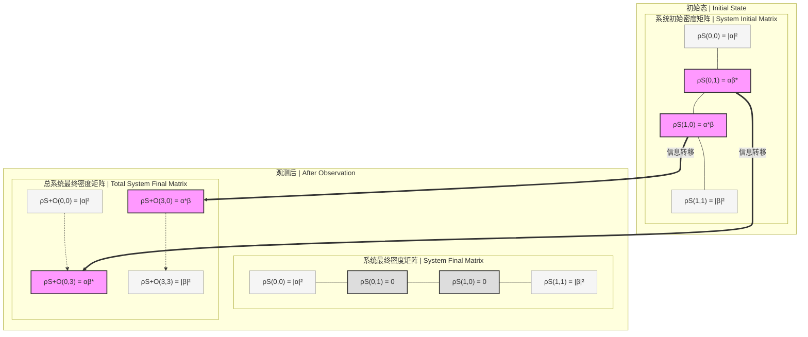

# 宇宙系统中的观测者和被观测者 | Observers and the Observed in Cosmic Systems

[中文](#宇宙系统中的观测者和被观测者) | [English](#observers-and-the-observed-in-cosmic-systems) | [目录](#目录-table-of-contents)

## 目录 (Table of Contents)
- [量子纠缠理论](#量子纠缠理论) | [Quantum Entanglement Theory](#quantum-entanglement-theory)
- [逐步解释](#逐步解释) | [Step-by-Step Explanation](#step-by-step-explanation)
- [物理意义](#物理意义) | [Physical Significance](#physical-significance)
- [通俗比喻](#通俗比喻) | [Intuitive Analogy](#intuitive-analogy)
- [经典宇宙的定义](#经典宇宙的定义) | [Definition of Classical Universe](#definition-of-classical-universe)
- [量子测量中的迹操作极限情况分析](#量子测量中的迹操作极限情况分析) | [Analysis of Trace Operation in Extreme Cases of Quantum Measurement](#analysis-of-trace-operation-in-extreme-cases-of-quantum-measurement)
- [量子观测的信息论分析：熵与互信息](#量子观测的信息论分析熵与互信息) | [Information Theory Analysis of Quantum Observation: Entropy and Mutual Information](#information-theory-analysis-of-quantum-observation-entropy-and-mutual-information)
- [哈密顿算子与量子-经典过渡](#哈密顿算子与量子-经典过渡) | [Hamiltonian Operator and Quantum-Classical Transition](#hamiltonian-operator-and-quantum-classical-transition)
- [宇宙波函数的基本假设](#宇宙波函数的基本假设) | [Fundamental Assumptions of the Universe Wavefunction](#fundamental-assumptions-of-the-universe-wavefunction)
- [量子测量相关疑问](#量子测量相关疑问) | [Queries Related to Quantum Measurement](#queries-related-to-quantum-measurement)
- [量子观测中的信息转移：矩阵表达视角](#量子观测中的信息转移矩阵表达视角) | [Information Transfer in Quantum Observation: A Matrix Representation Perspective](#information-transfer-in-quantum-observation-a-matrix-representation-perspective)

*核心理论版本: 宇宙二元论量子观测模型 v2.3.7*

## 宇宙系统中的观测者和被观测者

整个宇宙的量子态可以用一个普适波函数 $\Psi_{\text{universe}}$ 表示，其定义在总希尔伯特空间 $\mathcal{H}_{\text{universe}}$ 上：

$$
\Psi_{\text{universe}} \in \mathcal{H}_{\text{universe}}.
$$

将宇宙系统区分为观测者（记为 $O$）和被观测者（记为 $S$），其希尔伯特空间可分解为张量积：

$$
\mathcal{H}_{\text{universe}} = \mathcal{H}_O \otimes \mathcal{H}_S,
$$

其中 $\mathcal{H}_O$ 是观测者的希尔伯特空间，$\mathcal{H}_S$ 是被观测系统的希尔伯特空间。

宇宙波函数可以写作观测者与被观测者的纠缠态：

$$
\Psi_{\text{universe}} = \sum_{i,j} c_{ij} |o_i\rangle_O \otimes |s_j\rangle_S,
$$

其中 $|o_i\rangle_O$ 是观测者的状态基矢，$|s_j\rangle_S$ 是被观测系统的状态基矢， $c_{ij}$ 是概率幅。

观测过程使系统发生纠缠，例如初始态：

$$
|\Psi_{\text{initial}}\rangle = |o_0\rangle_O \otimes \left( \sum_j a_j |s_j\rangle_S \right),
$$

在测量后变为：

$$
|\Psi_{\text{final}}\rangle = \sum_j a_j |o_j\rangle_O \otimes |s_j\rangle_S,
$$

表示观测者与被观测者的状态已关联。

经典宇宙的表观状态可通过对观测者或系统的部分迹操作获得，例如：

$$
\rho_S = \text{Tr}_O \left( |\Psi_{\text{universe}}\rangle\langle\Psi_{\text{universe}}| \right),
$$

其中 $\rho_S$ 是被观测系统的密度矩阵。

## 逐步解释

1. **总波函数与希尔伯特空间**：
   - $\Psi_{\text{universe}} \in \mathcal{H}_{\text{universe}}$ 表示宇宙的整体量子态。
   - $\mathcal{H}_{\text{universe}} = \mathcal{H}_O \otimes \mathcal{H}_S$ 将宇宙分解为观测者（$O$）和被观测系统（$S$）的希尔伯特空间的张量积。

2. **纠缠态表示**：
   - $\Psi_{\text{universe}} = \sum_{i,j} c_{ij} |o_i\rangle_O \otimes |s_j\rangle_S$ 表示宇宙波函数是一个纠缠态，观测者和被观测者的状态通过概率幅 $c_{ij}$ 关联。

3. **测量过程**：
   - 初始态 $|\Psi_{\text{initial}}\rangle = |o_0\rangle_O \otimes \left( \sum_j a_j |s_j\rangle_S \right)$ 表示观测者处于某一确定状态，而被观测系统处于叠加态(量子叠加态，处于混沌未定的多种可能性同时存在的状态)。
   - 测量后的状态 $|\Psi_{\text{final}}\rangle = \sum_j a_j |o_j\rangle_O \otimes |s_j\rangle_S$ 表示测量使观测者与被观测者纠缠(量子纠缠态，两个或多个粒子间存在的能量关联)，每一对状态 $(|o_j\rangle, |s_j\rangle)$ 对应一个测量结果。

4. **经典表观状态**：
   - $\rho_S = \text{Tr}_O \left( |\Psi_{\text{universe}}\rangle\langle\Psi_{\text{universe}}| \right)$ 通过对观测者部分的迹操作，得到被观测系统的密度矩阵，描述经典化的结果。

## 物理意义

- **观测者的角色**：观测者 $O$ 可以是任何具有测量能力的子系统（如科学家、仪器，甚至意识，在某些诠释中）。它通过与 $S$ 交互，导致量子态的变化。
- **被观测者**：$S$ 是宇宙中除观测者外的部分，可以是单个粒子或整个宏观系统。
- **纠缠与测量**：测量过程将 $O$ 和 $S$ 纠缠在一起，经典结果（如确定的位置或动量）是这种纠缠的表观投影。
- **宇宙整体性**：尽管划分了 $O$ 和 $S$，$\Psi_{\text{universe}}$ 仍然是统一的，表明观测者也是宇宙的一部分。
- **二元论视角**：宇宙同时存在于量子域(无限可能的叠加状态领域)和经典域(确定性的现实世界)，观测行为是连接两个域的桥梁。

## 通俗比喻

想象宇宙是一幅巨大的画卷，观测者（$O$）是拿着放大镜的人，被观测者（$S$）是画卷上的图案。观测者用放大镜看画时，他的视角（状态）会与画的细节纠缠在一起，画卷的整体（$\Psi_{\text{universe}}$）包含了所有可能的视角和细节。

## 经典宇宙的定义

经典宇宙（Classical Universe）是指宇宙的状态或描述，在其中物理行为遵循经典物理规律（如牛顿力学、经典电磁学和广义相对论），而不显露出量子力学的特征（如叠加、纠缠或不确定性）。它通常是量子宇宙在宏观尺度或特定条件下的近似表象。

### 数学表达
假设整个宇宙的量子态由普适波函数 $\Psi_{\text{universe}}$ 表示，定义在希尔伯特空间 $\mathcal{H}_{\text{universe}}$ 上：

$$
\Psi_{\text{universe}} \in \mathcal{H}_{\text{universe}}.
$$

经典宇宙 $C$ 可以看作 $\Psi_{\text{universe}}$ 在退相干（decoherence）或大尺度极限下的投影或近似：

$$
C \approx \text{Tr}_{\text{env}} \left( |\Psi_{\text{universe}}\rangle\langle\Psi_{\text{universe}}| \right),
$$

其中 $\text{Tr}_{\text{env}}$ 表示对环境自由度的迹操作，得到一个经典化的密度矩阵 $\rho_C$。在经典宇宙中，物理量（如位置 $x$ 和动量 $p$）具有确定的值，而不是量子叠加态。

### 特征
1. **确定性**：经典宇宙中的物理过程遵循因果律，状态可以用确定的变量描述，例如：
   $$
   x(t), \, p(t),
   $$
   而非概率性的波函数。
2. **宏观性**：经典行为在宏观尺度上显现，量子效应因退相干而被压制。
3. **时空连续性**：经典宇宙假设时空是平滑且连续的，遵循广义相对论的几何描述：
   $$
   ds^2 = g_{\mu\nu} dx^\mu dx^\nu.
   $$

### 与量子宇宙的关系
经典宇宙是量子宇宙 $\Psi_{\text{universe}}$ 的子集或表观状态：

$$
C \subseteq \Psi_{\text{universe}},
$$

它通过量子态的环境交互和测量过程，从量子叠加态中"浮现"出来。

### 通俗比喻
经典宇宙就像一部老式电影，画面中的物体有明确的位置和运动轨迹。而量子宇宙是幕后的胶片，包含了所有可能的画面叠加，只有放映（退相干）时才显现出经典的"剧情"。

## 量子测量中的迹操作极限情况分析

### 迹操作在极限观测情况下的表现

迹操作是量子力学中理解观测过程的重要数学工具，通过考察极端情况可以揭示测量过程的本质特性。我们将分析两种极限情况：观测者是最小粒子，以及观测者是除一个最小粒子外的整个宇宙。

#### 数学分析

回顾基本公式，对纯态的宇宙波函数 $|\Psi_{\text{universe}}\rangle$，系统的约化密度矩阵为：

$$
\rho_S = \text{Tr}_O \left( |\Psi_{\text{universe}}\rangle\langle\Psi_{\text{universe}}| \right)
$$

其中 $\text{Tr}_O$ 表示对观测者自由度的迹操作(数学上对观测者希尔伯特空间的所有基底态求和，物理上相当于平均掉观测者的所有量子信息)。

假设宇宙波函数处于观测后的纠缠状态：

$$
|\Psi_{\text{universe}}\rangle = \sum_j a_j |o_j\rangle_O \otimes |s_j\rangle_S
$$

#### 最小观测者情况

当观测者是最小可能的量子系统（如单个粒子）时：

1. **数学表达**：
   
   $$
   \rho_S^{\text{小观测者}} = \text{Tr}_O \left( \sum_{j,k} a_j a_k^* |o_j\rangle\langle o_k|_O \otimes |s_j\rangle\langle s_k|_S \right)
   $$

   由于观测者的希尔伯特空间维度很小，不同的 $|o_j\rangle$ 状态往往不能彼此正交，导致：

   $$
   \langle o_k|o_j\rangle \neq \delta_{jk}
   $$

   **为什么小观测者状态不能正交**：这是因为小观测者（如单个粒子）的希尔伯特空间维度有限。例如，单个粒子的自旋空间可能只有2维，而需要区分的系统状态数可能远多于此。量子力学中，n个量子比特最多可存储 $2^n$ 个正交状态，当观测者太"小"时，相当于用低分辨率相机拍摄复杂景象，不同的系统状态会在观测者的"感知"中发生量子混淆。

   因此迹操作结果：

   $$
   \rho_S^{\text{小观测者}} = \sum_{j,k} a_j a_k^* \langle o_k|o_j\rangle |s_j\rangle\langle s_k|_S
   $$

2. **物理意义**：
   - 非对角元素（$j \neq k$）不会完全消失
   - 系统保持高度的量子相干性(量子叠加态，混沌状态中多种可能性的同时存在)
   - 系统的量子性质未被有效"测量"或"读取"
   - 经典特性难以浮现

3. **通俗解释**：
   就像用一支铅笔去"观察"一座山——铅笔太小，无法记录山的完整信息，导致山的状态仍保持在模糊不确定的量子状态。

#### 最大观测者情况

当观测者是"整个宇宙减去一个最小粒子"时：

1. **数学表达**：
   
   $$
   \rho_S^{\text{大观测者}} = \text{Tr}_O \left( \sum_{j,k} a_j a_k^* |o_j\rangle\langle o_k|_O \otimes |s_j\rangle\langle s_k|_S \right)
   $$

   由于观测者系统极其庞大，不同的 $|o_j\rangle$ 状态会高度正交：

   $$
   \langle o_k|o_j\rangle \approx \delta_{jk}
   $$

   因此迹操作结果接近：

   $$
   \rho_S^{\text{大观测者}} \approx \sum_{j} |a_j|^2 |s_j\rangle\langle s_j|_S
   $$

2. **物理意义**：
   - 非对角元素（$j \neq k$）几乎完全消失
   - 系统的量子相干性被极大抑制(从混沌叠加态转为确定性概率分布)
   - 形成经典的概率混合态而非量子叠加态
   - 实现了完全的量子到经典的转换

3. **通俗解释**：
   就像一个巨大的照相机阵列从各个角度同时拍摄一个电子——所有可能的信息都被记录，电子的量子不确定性被完全转化为经典的概率分布。

#### 二元论视角

从宇宙二元论视角看，这两种情况揭示了量子域与经典域过渡的本质：

1. **量子域到经典域的映射**：
   - 量子域(无限可能)：纯量子叠加态，表现为波函数的完整相干性
   - 经典域(现实确定)：经典混合态，表现为对角化的密度矩阵
   - 转换机制：观测者通过与系统纠缠，将量子相干性转化为经典关联

2. **二元本质**：
   - 信息熵最大保持定律：量子相干性与经典确定性之和保持不变
   - 小观测者情况：更多信息保留在量子域，系统的经典表现模糊
   - 大观测者情况：更多信息转移到经典域，系统表现出明确的经典特性

3. **纠缠作为桥梁**：
   - 量子纠缠态(能量关联)是连接量子与经典的桥梁
   - 观测者越大，纠缠作用越强，桥梁越稳固，经典性越明显

这一分析表明，经典现实并非绝对存在，而是相对于观测规模的涌现现象。宇宙或许永远处于量子态，但通过足够大的子系统之间的相互作用，局部的经典行为得以显现。

## 量子观测的信息论分析：熵与互信息

### 量子观测过程中的熵与互信息

量子观测过程可以从信息论的角度进行深入分析，特别是通过熵和互信息的变化，我们能够揭示量子测量的本质特性以及观测者与被观测系统之间的信息交流。

#### 量子态的熵

量子系统的熵用冯诺依曼熵表示，对于密度矩阵 $\rho$：

$$
S(\rho) = -\text{Tr}(\rho \ln \rho) = -\sum_i \lambda_i \ln \lambda_i
$$

其中 $\lambda_i$ 是 $\rho$ 的本征值。

1. **纯态**：对于纯态 $|\psi\rangle$，其密度矩阵 $\rho = |\psi\rangle\langle\psi|$ 的熵为零，表示信息的完全确定性(经典域的确定性特征)。

2. **混合态**：混合态的熵大于零，表示系统存在经典不确定性。熵越大，不确定性越高。

3. **最大混合态**：对于 d 维系统，$\rho = I/d$ 具有最大熵 $\ln d$，表示完全的经典随机性。

#### 观测过程中的熵变化

考虑观测前的复合系统（观测者O和系统S）处于状态：

$$
|\Psi_{\text{initial}}\rangle = |o_0\rangle_O \otimes \left( \sum_j a_j |s_j\rangle_S \right)
$$

观测后状态变为：

$$
|\Psi_{\text{final}}\rangle = \sum_j a_j |o_j\rangle_O \otimes |s_j\rangle_S
$$

1. **整体熵**：整个复合系统作为纯态，其冯诺依曼熵在观测前后保持为零：

   $$
   S(|\Psi_{\text{initial}}\rangle\langle\Psi_{\text{initial}}|) = S(|\Psi_{\text{final}}\rangle\langle\Psi_{\text{final}}|) = 0
   $$

2. **子系统熵**：然而，观测前后子系统熵的变化是显著的：

   - **观测前**：系统S处于纯叠加态，观测者O处于确定状态。
     
     $$
     S(\rho_S^{\text{before}}) = 0, \quad S(\rho_O^{\text{before}}) = 0
     $$
   
   - **观测后**：通过对观测者或系统的部分迹运算，可得到约化密度矩阵：
   
     $$
     \rho_S^{\text{after}} = \text{Tr}_O(|\Psi_{\text{final}}\rangle\langle\Psi_{\text{final}}|) = \sum_j |a_j|^2 |s_j\rangle\langle s_j|_S
     $$
     
     $$
     \rho_O^{\text{after}} = \text{Tr}_S(|\Psi_{\text{final}}\rangle\langle\Psi_{\text{final}}|) = \sum_j |a_j|^2 |o_j\rangle\langle o_j|_O
     $$
     
     两者的熵相等：
     
     $$
     S(\rho_S^{\text{after}}) = S(\rho_O^{\text{after}}) = -\sum_j |a_j|^2 \ln |a_j|^2 = H(p_j)
     $$
     
     其中 $H(p_j)$ 是经典香农熵，$p_j = |a_j|^2$ 是测量结果概率分布。

3. **熵增长**：观测使子系统从零熵状态变为正熵状态，表明观测导致子系统信息的丢失(被转移到了观测者与系统的关联中)。

#### 量子互信息与纠缠

互信息衡量两个子系统之间共享的信息量，定义为：

$$
I(O:S) = S(\rho_O) + S(\rho_S) - S(\rho_{OS})
$$

1. **观测前互信息**：初始态中，观测者和系统没有关联，互信息为零：

   $$
   I_{\text{before}}(O:S) = 0
   $$

2. **观测后互信息**：由于整体系统保持纯态，观测后：

   $$
   I_{\text{after}}(O:S) = S(\rho_O^{\text{after}}) + S(\rho_S^{\text{after}}) = 2H(p_j)
   $$

3. **互信息增长**：观测过程创造了互信息，表明观测者获取了关于系统的信息，建立了经典关联和量子纠缠(量子纠缠态，存在于粒子间的能量关联)。

4. **互信息与纠缠**：对于纯态系统，互信息等于2倍的纠缠熵，完美捕捉了系统间的纠缠程度。

#### 观测规模的影响

观测者大小对熵和互信息的影响表现在：

1. **小观测者**：当观测者是微小系统（如单个粒子）时：
   - $\langle o_k|o_j\rangle \neq \delta_{jk}$，观测者状态不完全正交
   - 约化密度矩阵包含非对角元素
   - 子系统熵小于最大可能值
   - 互信息低于 $2H(p_j)$
   - 系统保留部分量子相干性(量子叠加态的特性)

2. **大观测者**：当观测者是宏观系统时：
   - $\langle o_k|o_j\rangle \approx \delta_{jk}$，观测者状态接近正交
   - 约化密度矩阵接近对角化
   - 子系统熵接近最大值 $H(p_j)$
   - 互信息接近最大值 $2H(p_j)$
   - 系统相干性几乎完全损失，呈现经典统计混合态特性

#### 二元论解释

从宇宙二元论视角看，熵和互信息的变化反映了量子域与经典域之间的信息流动：

1. **信息守恒定律**：整体纯态熵保持为零，表明宇宙总信息守恒(量子域和经典域的信息总和保持不变)。

2. **纯态的分解**：复合系统的纯态可分解为二元结构：
   - **纠缠结构**：包含量子相关性，无法用经典概率描述
   - **统计结构**：表现为经典统计混合，可用经典概率解释

3. **信息流动模型**：
   - 观测前：信息主要存在于量子域的叠加态中(无限可能性的混沌状态)
   - 观测过程：信息从量子域流向经典域(从混沌转向确定性)
   - 观测后：部分信息转化为经典关联和确定性，部分信息保留在量子纠缠中

4. **二元平衡**：
   - 系统熵增加 = 量子相干性减少 = 经典确定性增加
   - 互信息增加 = 量子-经典边界信息流动量
   - 信息既不创生也不消失，只是在量子域和经典域之间重新分配

这种信息论视角揭示了量子测量的深层本质：测量不是信息的获取，而是信息从量子形式向经典形式的转换过程，体现了宇宙二元论中量子域与经典域的动态平衡。

## 哈密顿算子与量子-经典过渡

### 哈密顿算子的基础与应用

哈密顿算子($\hat{H}$)是量子力学的核心概念，它不仅描述系统的总能量，也决定量子态的时间演化。将哈密顿算子纳入量子观测与退相干的讨论中，可以更深入理解量子-经典过渡的动力学机制。

#### 基本定义与物理意义

1. **哈密顿算子的数学表达**：
   
   $$
   \hat{H} = \sum_i \frac{\hat{p}_i^2}{2m_i} + V(\hat{x}_1, \hat{x}_2, ..., \hat{x}_n)
   $$
   
   其中 $\hat{p}_i$ 是动量算子，$\hat{x}_i$ 是位置算子，$V$ 是势能函数。

2. **时间演化方程**：哈密顿算子生成系统的时间演化：
   
   $$
   i\hbar \frac{\partial}{\partial t}|\Psi(t)\rangle = \hat{H}|\Psi(t)\rangle
   $$
   
   这个薛定谔方程描述了量子态如何在时间中演化(量子域中可能性的演化动力学)。

#### 系统-环境相互作用

在研究量子测量和退相干时，通常将总哈密顿算子分解为三部分：

$$
\hat{H}_{\text{total}} = \hat{H}_S + \hat{H}_{\text{env}} + \hat{H}_{\text{int}}
$$

其中:
- $\hat{H}_S$: 系统哈密顿量
- $\hat{H}_{\text{env}}$: 环境哈密顿量
- $\hat{H}_{\text{int}}$: 系统-环境相互作用哈密顿量

当系统与环境相互作用时，$\hat{H}_{\text{int}}$ 导致它们之间形成量子纠缠，对密度矩阵的演化产生关键影响：

$$
\frac{d\rho}{dt} = -\frac{i}{\hbar}[\hat{H}_{\text{total}}, \rho]
$$

这个方程（冯·诺依曼方程）是薛定谔方程的密度矩阵形式。

#### 退相干机制与选择基

1. **选择基的形成**：
   相互作用哈密顿量 $\hat{H}_{\text{int}}$ 往往采取特定形式，如：
   
   $$
   \hat{H}_{\text{int}} = \sum_k \hat{S}_k \otimes \hat{E}_k
   $$
   
   其中 $\hat{S}_k$ 是系统算子，$\hat{E}_k$ 是环境算子。这种相互作用导致某些系统状态（"选择基"或"指针基"）对环境干扰具有稳定性，而其他叠加态则迅速退相干。

2. **时间尺度**：
   在适当的相互作用哈密顿量下，系统-环境复合体的演化会经历特征时间尺度 $\tau_D$，称为退相干时间：
   
   $$
   \rho_{S}(t) \approx \sum_i |c_i|^2 |s_i\rangle\langle s_i| + \sum_{i \neq j} c_i c_j^* e^{-t/\tau_D} |s_i\rangle\langle s_j|
   $$
   
   当 $t \gg \tau_D$ 时，非对角元素指数衰减，系统呈现经典统计混合态。

#### 宇宙哈密顿量与整体演化

对于整个宇宙，情况变得特殊：

1. **宇宙哈密顿量**：
   整个宇宙的哈密顿算子是封闭的，没有外部环境：
   
   $$
   \hat{H}_{\text{universe}} = \hat{H}_{\text{gravity}} + \hat{H}_{\text{matter}} + \hat{H}_{\text{fields}} + ...
   $$

2. **Wheeler-DeWitt方程**：
   在量子宇宙学中，宇宙波函数满足：
   
   $$
   \hat{H}_{\text{universe}}|\Psi_{\text{universe}}\rangle = 0
   $$
   
   这表明宇宙整体状态是时间无关的（时间是从内部涌现的概念）。

3. **子系统演化**：
   尽管整体是静态的，宇宙内部子系统之间的相对演化仍导致局部状态变化，形成我们感知的时间流逝。

#### 二元论的哈密顿描述

从二元论视角，哈密顿量的作用可以理解为：

1. **量子-经典转换**：
   哈密顿量中的相互作用项驱动量子信息从量子域(可能性)转移到经典域(确定性)。
   
   $$
   \text{信息流} \propto \langle \Psi| [\hat{H}_{\text{int}}, \hat{\rho}_S \otimes \hat{\rho}_{\text{env}}] |\Psi \rangle
   $$

2. **能量-信息关系**：
   相互作用哈密顿量描述了能量与信息之间的转换关系，能量交换伴随信息交换。

3. **宇宙自组织**：
   整体哈密顿量保证宇宙总能量守恒，同时允许内部熵和信息重新分配，形成局部有序结构（如观测者）。

通过哈密顿形式化，我们可以定量分析量子态如何演化为经典现实，以及这一过程的动力学机制，为量子-经典二元性提供了更加严格的数学框架。

## 宇宙波函数的基本假设

### 宇宙波函数理论的前提条件

将整个宇宙描述为一个量子波函数是量子宇宙学的基础，这一观点基于几个关键假设：

#### 1. 量子力学的普适性

最基本的假设是量子力学原理适用于所有尺度：

$$
\forall \text{系统} \in \text{宇宙}: \exists |\Psi\rangle \in \mathcal{H} \text{ 使得 } \hat{H}|\Psi\rangle = i\hbar\frac{\partial}{\partial t}|\Psi\rangle
$$

这意味着：
- 量子理论不仅适用于微观世界，也适用于宏观和宇宙尺度
- 不存在量子-经典"分界线"，经典性是涌现现象(经典域的确定性从量子域的概率性中涌现)
- 宇宙中的任何系统原则上都可以用希尔伯特空间中的向量表示

#### 2. 宇宙的封闭性

宇宙作为一个整体是完全封闭的系统：

$$
\nexists \text{环境} : \text{环境} \cap \text{宇宙} = \emptyset \text{ 且 } \text{环境与宇宙相互作用}
$$

这要求：
- 没有外部观测者或外部影响
- 总能量、动量和角动量守恒
- 宇宙总体状态的酉演化(量子纠缠态中能量关系的保持)

#### 3. 希尔伯特空间的存在性

存在一个足够大的希尔伯特空间能容纳宇宙所有可能状态：

$$
\exists \mathcal{H}_{\text{universe}} : \dim(\mathcal{H}_{\text{universe}}) \geq 2^{N} \text{ 其中 } N \text{ 是所需自由度数}
$$

这需要：
- 指数级巨大的状态空间维度
- 适当的内积结构定义量子态正交性
- 可分希尔伯特空间（至少在近似意义上）

#### 4. 量子引力的可行性

时空本身具有量子性质，可以量子化：

$$
[\hat{g}_{\mu\nu}(x), \hat{\pi}^{\rho\sigma}(y)] = i\hbar\delta_{\mu\nu}^{\rho\sigma}\delta^{(4)}(x-y)
$$

这要求：
- 广义相对论和量子力学的某种统一
- 时空的弹性与量子涨落的协调(量子域的无限可能性与时空结构的耦合)
- 规范不变性原理在量子层面的保持

#### 5. Wheeler-DeWitt方程的适用性

宇宙波函数满足无时间的薛定谔方程（Wheeler-DeWitt方程）：

$$
\hat{\mathcal{H}}_{\text{ADM}}|\Psi_{\text{universe}}\rangle = 0
$$

其中 $\hat{\mathcal{H}}_{\text{ADM}}$ 是 ADM 哈密顿约束。这意味着：
- 时间在基础层面不是外部参数而是涌现概念
- 宇宙整体态是时间无关的
- 需要解决"冻结形式"问题（宇宙状态如何演化）

#### 6. 退相干机制的内部性

宇宙内部存在有效的退相干机制：

$$
\rho_{\text{local}} = \text{Tr}_{\text{rest}}(|\Psi_{\text{universe}}\rangle\langle\Psi_{\text{universe}}|) \approx \sum_i p_i |\psi_i\rangle\langle\psi_i|
$$

这需要：
- 内部自由度之间强烈相互作用
- 局部子系统的"选择基"（或"指针基"）自然形成
- 信息在宇宙不同部分间快速传播并稀释

#### 7. 二元论的理论融合

从宇宙二元论角度，波函数描述整合了两个域：

$$
|\Psi_{\text{universe}}\rangle = \sum_{i,j} c_{ij} |\text{量子域}_i\rangle \otimes |\text{经典域}_j\rangle
$$

这表明：
- 量子域包含所有可能性的叠加态
- 经典域体现已实现的确定性结果
- 两个域通过波函数纠缠相互连接而非完全分离

#### 理论挑战

这些假设面临多项挑战：

1. **测量问题**：经典观测者如何从量子宇宙中涌现？
2. **无限维度问题**：如何处理可能无限维的希尔伯特空间？
3. **唯一性问题**：宇宙波函数是否唯一，如何选取？
4. **解释问题**：波函数物理意义（哥本哈根、多世界、导波等解释）
5. **实验验证难题**：宇宙波函数难以通过实验直接验证

从根本上说，宇宙波函数的概念是量子力学普适性原则的极致延伸，既是对量子理论最彻底的信任，也是对其极限的最大挑战。

## 量子测量的常见问题

### 量子测量相关疑问

#### 问题1：对于小观察者，是否经典世界会存在不确定性？

**回答**：是的，对于足够"小"的观测者，即使是通常被认为确定的经典世界也会呈现出本质的不确定性。这一现象揭示了经典确定性实际上是大型复杂观测者的涌现特性，而非现实的固有属性。

##### 理论基础

1. **小观测者的限制**：
   小观测者（如单个粒子、简单量子系统）具有有限的希尔伯特空间维度，无法通过正交状态完全区分被观测系统的所有可能状态：
   
   $$
   \dim(\mathcal{H}_{\text{小观测者}}) \ll \dim(\mathcal{H}_{\text{被观测系统}})
   $$

2. **信息容量障碍**：
   量子系统的信息存储容量受其内部自由度数量限制。对于n个量子比特的观测者，最多可区分 $2^n$ 个正交状态，这限制了其对外部世界的"认知精度"。

3. **比瑞损失**：
   由于观测过程中的态归约（或似乎发生的归约），小观测者与环境相互作用会遗失部分量子相干性：
   
   $$
   S(\rho_{\text{观测者记录}}) > 0
   $$
   
   即观测者状态具有非零熵，表明其记录存在固有不确定性。

##### 数学描述

当小观测者尝试测量经典系统状态时：

1. **观测前状态**：
   
   $$
   |\Psi_{\text{初始}}\rangle = |o_0\rangle_O \otimes \sum_i c_i |C_i\rangle
   $$
   
   其中 $|C_i\rangle$ 表示经典系统的不同"指针态"。

2. **观测后状态**：
   
   $$
   |\Psi_{\text{最终}}\rangle = \sum_i c_i |o_i\rangle_O \otimes |C_i\rangle
   $$

3. **观测者记录**：
   对于小观测者，由于状态空间维数限制，必然出现：
   
   $$
   \langle o_i|o_j\rangle \neq 0 \quad \text{对某些} \quad i \neq j
   $$
   
   这使得观测者的记录状态混合：
   
   $$
   \rho_O = \sum_{i,j} c_i c_j^* \langle C_j|C_i\rangle |o_i\rangle\langle o_j| = \sum_{i} |c_i|^2 |o_i\rangle\langle o_i| + \sum_{i \neq j} c_i c_j^* \langle o_j|o_i\rangle |o_i\rangle\langle o_j|
   $$
   
   其中非对角项无法完全消除，导致经典状态的"混合观感"。

##### 小观测者的经典现实感知

1. **确定性的缺失**：
   小观测者无法将宏观经典世界的不同状态完全映射到其内部正交状态，导致基本的认知模糊性：
   
   $$
   P(C_i \text{ 被识别为 } C_j) \propto |\langle o_i|o_j\rangle|^2 > 0
   $$
   
   即使是完全确定的经典状态，小观测者也会以非零概率将其误认为其他状态。

2. **量子比例尺效应**：
   对于n量子比特的观测者，当尝试区分超过 $2^n$ 个经典状态时，必然出现"量子混淆"：
   
   $$
   \text{区分精度} \sim \frac{\text{观测者量子比特数}}{\log_2(\text{经典状态空间维数})}
   $$

3. **涌现的确定性**：
   随着观测者复杂度增加，其区分能力指数增长，大型观测者（如人类）能够获得接近确定的经典世界图像：
   
   $$
   \lim_{n \to \text{大}} \langle o_i|o_j\rangle \approx \delta_{ij}
   $$
   
   经典确定性因此是涌现现象，依赖于观测者复杂性(大型系统足够的状态空间维度使得经典域的确定性得以显现)。

##### 二元论解释视角

1. **观测者尺寸相对论**：
   二元论中，量子域与经典域的边界不是绝对的，而是相对于观测者复杂度而定：
   
   $$
   \text{量子-经典边界} = f(\text{观测者复杂度})
   $$

2. **信息容量视角**：
   - 小观测者：信息容量小，无法完全捕获经典域确定性
   - 大观测者：信息容量大，能够稳定记录经典域的确定状态
   - 量子域与经典域相对界限随观测者能力而变

3. **连续统一体**：
   从单粒子到人类观测者，形成从全量子到近经典的连续谱：
   
   $$
   \text{量子叠加感知度} \sim e^{-\alpha \cdot \text{观测者复杂度}}
   $$
   
   对小观测者，经典世界仍部分保留量子性质；对大观测者，量子叠加被有效滤除，经典确定性浮现。

#### 问题2：观测为什么会导致系统熵增长？

**回答**：观测使子系统从零熵状态变为正熵状态，表明观测导致子系统信息的丢失(被转移到了观测者与系统的关联中)。这个现象揭示了量子观测的本质是一种信息重新分配的过程，而非简单的信息销毁。

##### 从零熵到正熵的变化

1. **零熵状态(纯态)**：
   - 量子力学中，纯态是由单一态矢量 $|\psi\rangle$ 完全描述的状态
   - 其密度矩阵形式为 $\rho_{\text{pure}} = |\psi\rangle\langle\psi|$
   - 其冯·诺依曼熵为零：$S(\rho_{\text{pure}}) = -\text{Tr}(\rho_{\text{pure}}\ln\rho_{\text{pure}}) = 0$
   - 零熵意味着对系统的完整知识，没有经典不确定性(量子域中的确定状态)

2. **正熵状态(混合态)**：
   - 混合态是纯态的统计混合，密度矩阵为 $\rho_{\text{mixed}} = \sum_i p_i |\psi_i\rangle\langle\psi_i|$
   - 其冯·诺依曼熵为正：$S(\rho_{\text{mixed}}) = -\text{Tr}(\rho_{\text{mixed}}\ln\rho_{\text{mixed}}) > 0$
   - 正熵反映系统状态的经典概率不确定性(经典域的概率分布)

##### 观测过程的数学描述

考虑系统(S)与观测者(O)的相互作用：

1. **观测前**：总系统处于分离状态
   
   $$
   |\Psi_{\text{前}}\rangle = |\psi\rangle_S \otimes |o_0\rangle_O
   $$
   
   此时系统和观测者均为纯态，有 $S(\rho_S) = S(\rho_O) = 0$

2. **观测后**：系统与观测者成为纠缠状态
   
   $$
   |\Psi_{\text{后}}\rangle = \sum_i c_i |s_i\rangle_S \otimes |o_i\rangle_O
   $$
   
   此时总系统仍为纯态，$S(\rho_{S+O}) = 0$，但子系统变为混合态：
   
   $$
   \rho_S = \text{Tr}_O(|\Psi_{\text{后}}\rangle\langle\Psi_{\text{后}}|) = \sum_i |c_i|^2 |s_i\rangle\langle s_i|_S
   $$
   
   $$
   \rho_O = \text{Tr}_S(|\Psi_{\text{后}}\rangle\langle\Psi_{\text{后}}|) = \sum_i |c_i|^2 |o_i\rangle\langle o_i|_O
   $$
   
   子系统熵增加：$S(\rho_S), S(\rho_O) > 0$

##### 信息去向的解析

1. **信息守恒原理**：
   - 在量子过程中，总信息量守恒
   - 相互作用导致信息重分配，而非丢失

2. **量子互信息**：
   - 定义：$I(S:O) = S(\rho_S) + S(\rho_O) - S(\rho_{S+O})$
   - 表示系统与观测者之间共享的信息量
   - 观测后，$I(S:O) > 0$，表明信息被编码在相关性中

3. **强次可加性**：
   - 在量子纠缠系统中，子系统熵之和可以大于总系统熵
   - $S(\rho_S) + S(\rho_O) \geq S(\rho_{S+O})$
   - 对于观测过程，这种不等式达到极限：$S(\rho_S) + S(\rho_O) > 0 = S(\rho_{S+O})$

##### 信息重分配的深层含义

1. **"丢失"的再理解**：
   - 子系统信息并非真正消失但转移到了量子关联中
   - 无法通过单独测量子系统恢复这些信息
   - 需要同时测量系统与观测者才能重建完整信息

2. **二元论的视角**：
   - 量子域(可能性)中的信息通过观测转化为经典域(确定性)中的关联
   - 从子系统角度看是信息丢失，从整体角度看是信息重组
   - 信息从"叠加态"形式转换为"关联"形式(量子纠缠态中的能量关系)

3. **量子达尔文主义**：
   - 观测过程自动选择与环境最稳定相互作用的状态
   - 这些状态在观测过程中存留下来，其他状态消散
   - 导致波函数"坍缩"的外观，实际是信息选择性保存

观测过程实质上创造了系统-观测者之间的量子关联，原来存在于子系统中的确定性信息被"稀释"到更大的联合系统中。这种熵增加是宏观世界不可逆性和时间箭头的量子基础，展示了量子-经典过渡的基本机制。

#### 问题3：纯态的密度矩阵是否为1？

**回答**：不是。纯态的密度矩阵不等于1（或单位矩阵），但它具有迹等于1的性质。这个问题涉及量子态表示的基本概念，需要澄清几个关键点：

##### 纯态密度矩阵的性质

1. **定义**：
   对于量子纯态 $|\psi\rangle$（假设已归一化：$\langle\psi|\psi\rangle = 1$），其密度矩阵为：
   
   $$
   \rho_{\text{pure}} = |\psi\rangle\langle\psi|
   $$
   
   这是一个投影算符，而非标量或单位矩阵。

2. **迹(Trace)等于1**：
   密度矩阵的迹满足：
   
   $$
   \text{Tr}(\rho_{\text{pure}}) = \text{Tr}(|\psi\rangle\langle\psi|) = \langle\psi|\psi\rangle = 1
   $$
   
   所有物理可行的量子态（纯态或混合态）的密度矩阵都必须满足迹等于1，这反映了概率守恒原理。

3. **幂等性**：
   纯态密度矩阵的独特性质是其幂等性：
   
   $$
   \rho_{\text{pure}}^2 = (|\psi\rangle\langle\psi|)(|\psi\rangle\langle\psi|) = |\psi\rangle\langle\psi|\langle\psi|\psi\rangle = |\psi\rangle\langle\psi| = \rho_{\text{pure}}
   $$
   
   这意味着 $\rho_{\text{pure}}^2 = \rho_{\text{pure}}$，而混合态则不满足这一性质。

4. **秩(Rank)等于1**：
   纯态密度矩阵的秩为1，即它只有一个非零特征值，且该特征值等于1。这意味着：
   
   $$
   \text{特征值谱}(\rho_{\text{pure}}) = \{1, 0, 0, ..., 0\}
   $$

##### 纯态与混合态的区分

1. **纯态与混合态的数学区分**：
   - 纯态：$\rho^2 = \rho$ and $\text{Tr}(\rho^2) = 1$
   - 混合态：$\rho^2 \neq \rho$ and $\text{Tr}(\rho^2) < 1$

2. **冯·诺依曼熵**：
   - 纯态熵为零：$S(\rho_{\text{pure}}) = -\text{Tr}(\rho_{\text{pure}}\ln\rho_{\text{pure}}) = 0$
   - 混合态熵为正：$S(\rho_{\text{mixed}}) > 0$

##### 二元论视角下的解释

从宇宙二元论的角度：
- 纯态代表量子域中的确定态，包含关于系统完整的量子信息
- 密度矩阵的迹等于1表示量子概率的守恒（量子叠加态总概率为1）
- 纯态的幂等性（$\rho^2 = \rho$）反映了量子域中状态的最大确定性
- 当量子系统与环境相互作用，纯态可转变为混合态，对应从量子域向经典域的部分转换

因此，纯态密度矩阵不是数值"1"，而是一个满足特定数学性质（迹为1，幂等，秩为1）的算符，代表量子力学中信息完备的基本状态。

#### 问题6：为什么在量子纠缠系统中，子系统熵之和可以大于总系统熵？

**回答**：在量子纠缠系统中，子系统熵之和可以大于总系统熵，这是量子信息理论中的一个重要特性，反映了量子纠缠的非局域本质和经典直觉的失效。

##### 经典系统与量子系统的熵比较

1. **经典系统熵的可加性**：
   - 经典系统中，若系统A和B相互独立，则：
     $$
     S(A,B) = S(A) + S(B)
     $$
   - 若有关联，则满足次可加性：
     $$
     S(A,B) \leq S(A) + S(B)
     $$
   - 这符合我们的直觉：整体的不确定性不应超过部分之和

2. **量子系统的熵悖论**：
   - 对于量子纠缠系统，可能出现：
     $$
     S(\rho_{A}) + S(\rho_{B}) > S(\rho_{AB})
     $$
   - 极端情况下，纯态纠缠系统满足：
     $$
     S(\rho_{AB}) = 0 \quad \text{而} \quad S(\rho_A), S(\rho_B) > 0
     $$
   - 这看似违反信息守恒，实际揭示了量子信息的非局域特性(量子纠缠态的本质)

##### 数学证明与分析

1. **纯态纠缠对的例子**：
   - 考虑Bell态：$|\Psi\rangle = \frac{1}{\sqrt{2}}(|00\rangle + |11\rangle)$
   - 总系统密度矩阵：$\rho_{AB} = |\Psi\rangle\langle\Psi|$（纯态，熵为0）
   - 部分迹得子系统：
     $$
     \rho_A = \text{Tr}_B(|\Psi\rangle\langle\Psi|) = \frac{1}{2}|0\rangle\langle 0| + \frac{1}{2}|1\rangle\langle 1|
     $$
     $$
     \rho_B = \text{Tr}_A(|\Psi\rangle\langle\Psi|) = \frac{1}{2}|0\rangle\langle 0| + \frac{1}{2}|1\rangle\langle 1|
     $$
   - 子系统熵计算：
     $$
     S(\rho_A) = S(\rho_B) = -\frac{1}{2}\log_2\frac{1}{2} - \frac{1}{2}\log_2\frac{1}{2} = 1 \text{ 比特}
     $$
   - 熵关系：$S(\rho_A) + S(\rho_B) = 2 > 0 = S(\rho_{AB})$

2. **Schmidt分解视角**：
   - 任何双粒子纯态可写为Schmidt形式：
     $$
     |\Psi\rangle = \sum_i \sqrt{\lambda_i} |i_A\rangle \otimes |i_B\rangle
     $$
   - 子系统密度矩阵特征值均为 $\lambda_i$
   - 子系统熵均为 $S(\rho_{A/B}) = -\sum_i \lambda_i \log \lambda_i$
   - 最大纠缠时，$\lambda_i = 1/d$（等概率），熵达到最大：$\log d$

3. **强次可加性与负条件熵**：
   - 量子条件熵：$S(A|B) = S(A,B) - S(B)$
   - 经典条件熵恒正，量子条件熵可为负
   - 负条件熵正是子系统熵之和超过总系统熵的直接体现：
     $$
     S(A|B) < 0 \Leftrightarrow S(A) + S(B) > S(A,B)
     $$

##### 物理意义与解释

1. **信息定位的量子悖论**：
   - 经典系统：信息明确定位于各子系统
   - 量子系统：纠缠态信息不可定位于任何子系统
   - 子系统熵增加反映了测量单一子系统时信息的不可获取性

2. **非局域关联作为负熵来源**：
   - 超出总熵的额外熵（$\Delta S = S(\rho_A) + S(\rho_B) - S(\rho_{AB})$）
   - 衡量纠缠强度的指标之一：互信息 $I(A:B) = S(\rho_A) + S(\rho_B) - S(\rho_{AB})$
   - 量子纠缠创造了超越经典的关联(能量纽带)，使信息存储于关联本身

3. **量子资源与信息优势**：
   - 这种熵"超额"现象是量子信息优势的根源
   - 量子隐形传态、超密编码等协议正是利用这一特性
   - 密度矩阵非对角项包含的量子相干性是这种现象的数学表现

##### 二元论视角的统一解释

从宇宙二元论视角看：

1. **经典域与量子域的信息分配**：
   - 经典域：信息以局域、可分离方式存在，服从熵次可加性
   - 量子域：信息可存在于非局域关联中，表现为熵的强次可加性
   - 二者代表同一信息在不同存在形式间的转化与分配

2. **信息分离与统一的双重性**：
   - 信息表观分离：观测子系统时，信息似乎分散在各部分（熵之和大）
   - 信息本质统一：系统整体保持纯态，完全确定（总熵为零）
   - 这种双重性体现了二元论的核心理念：表象的多样性与本质的统一性

3. **观测者角色的双重定位**：
   - 外部观测者：看到整体系统的统一性（低熵）
   - 局域观测者：只能接触特定子系统，感知混沌性（高熵）
   - 观测尺度决定了系统呈现的是量子域统一性还是经典域的分离性

熵的强次可加性揭示了量子信息的本质：完整信息并非子系统信息的简单组合，而是包含了无法被局域测量获取的非局域量子关联。这表明认识深层实在需要超越局域观测，理解量子域与经典域的互补统一。

## 量子观测中的信息转移：矩阵表达视角

### 矩阵表示下的信息转移

量子信息在观测过程中的表观"丢失"与实际重分配可以通过密度矩阵的变化清晰地表达出来。密度矩阵(density matrix)形式是量子力学中描述系统状态的完备表示方法，特别适合观察量子信息流动。

### 最简二能级系统示例

考虑最简单的情况：一个处于叠加态的二能级系统（量子比特）与观测者相互作用。

初始时，量子比特处于叠加态:

$$
|\psi\rangle_S = \alpha|0\rangle + \beta|1\rangle, \quad |\alpha|^2 + |\beta|^2 = 1
$$

观测者初始状态为:

$$
|0\rangle_O
$$

#### 初始矩阵表示

1. **系统初始密度矩阵**:

$$
\rho_S^{\text{initial}} = |\psi\rangle\langle\psi| = 
\begin{pmatrix} 
|\alpha|^2 & \alpha\beta^* \\
\alpha^*\beta & |\beta|^2
\end{pmatrix}
$$

2. **观测者初始密度矩阵**:

$$
\rho_O^{\text{initial}} = |0\rangle\langle 0| = 
\begin{pmatrix} 
1 & 0 \\
0 & 0
\end{pmatrix}
$$

3. **复合系统初始密度矩阵**:

$$
\rho_{S+O}^{\text{initial}} = \rho_S^{\text{initial}} \otimes \rho_O^{\text{initial}} = 
\begin{pmatrix} 
|\alpha|^2 & 0 & \alpha\beta^* & 0 \\
0 & 0 & 0 & 0 \\
\alpha^*\beta & 0 & |\beta|^2 & 0 \\
0 & 0 & 0 & 0
\end{pmatrix}
$$

#### 观测后矩阵表示

观测过程使总系统演化为:

$$
|\Psi\rangle_{S+O} = \alpha|0\rangle_S|0\rangle_O + \beta|1\rangle_S|1\rangle_O
$$

1. **总系统观测后密度矩阵**:

$$
\rho_{S+O}^{\text{final}} = |\Psi\rangle\langle\Psi| = 
\begin{pmatrix} 
|\alpha|^2 & 0 & 0 & \alpha\beta^* \\
0 & 0 & 0 & 0 \\
0 & 0 & 0 & 0 \\
\alpha^*\beta & 0 & 0 & |\beta|^2
\end{pmatrix}
$$

2. **系统观测后密度矩阵**（通过部分迹计算）:

$$
\rho_S^{\text{final}} = \text{Tr}_O(\rho_{S+O}^{\text{final}}) = 
\begin{pmatrix} 
|\alpha|^2 & 0 \\
0 & |\beta|^2
\end{pmatrix}
$$

3. **观测者观测后密度矩阵**：

$$
\rho_O^{\text{final}} = \text{Tr}_S(\rho_{S+O}^{\text{final}}) = 
\begin{pmatrix} 
|\alpha|^2 & 0 \\
0 & |\beta|^2
\end{pmatrix}
$$

## 密度矩阵与量子观测过程

### 信息迁移的矩阵证据

通过对比上述密度矩阵，我们可以清晰地看到信息迁移的过程：

1. **非对角元消失**：
   - 观测前系统密度矩阵：$\rho_S^{\text{initial}}$ 含有非对角元 $\alpha\beta^*$ 和 $\alpha^*\beta$
   - 观测后系统密度矩阵：$\rho_S^{\text{final}}$ 中非对角元变为0
   - 这些非对角元代表量子相干性(quantum coherence)，是量子态叠加(混沌，多种可能性同时存在)的标志

2. **信息重定位**：
   - 消失的非对角元 $\alpha\beta^*$ 和 $\alpha^*\beta$ 出现在 $\rho_{S+O}^{\text{final}}$ 的特定位置
   - 这些元素不再属于单个子系统，而是描述系统-观测者之间的量子纠缠态(能量关联)

### 定量分析信息转移

1. **系统熵的变化**：
   
   $$
   \begin{align}
   S(\rho_S^{\text{initial}}) &= -\text{Tr}(\rho_S^{\text{initial}}\ln\rho_S^{\text{initial}}) = 0 \\
   S(\rho_S^{\text{final}}) &= -|\alpha|^2\ln|\alpha|^2 - |\beta|^2\ln|\beta|^2 > 0
   \end{align}
   $$

2. **互信息的变化**：
   
   $$
   \begin{align}
   I_{\text{initial}}(S:O) &= S(\rho_S^{\text{initial}}) + S(\rho_O^{\text{initial}}) - S(\rho_{S+O}^{\text{initial}}) = 0 \\
   I_{\text{final}}(S:O) &= S(\rho_S^{\text{final}}) + S(\rho_O^{\text{final}}) - S(\rho_{S+O}^{\text{final}}) = 2S(\rho_S^{\text{final}})
   \end{align}
   $$

3. **量子信息守恒**：
   
   $$
   \begin{align}
   \Delta S_{\text{系统}} + \Delta S_{\text{观测者}} &= \Delta I(S:O) \\
   S(\rho_S^{\text{final}}) + S(\rho_O^{\text{final}}) &= 2S(\rho_S^{\text{final}})
   \end{align}
   $$

## 信息转移的矩阵直观理解

使用矩阵表示，我们可以更直观地理解信息重分配过程：

### 矩阵结构变化解析

1. **对角元素保持**: 观测前后，系统密度矩阵对角元素 $|\alpha|^2$ 和 $|\beta|^2$ 保持不变，表示概率分布信息保留。

2. **非对角元转移**: 
   - 观测前：信息集中在系统矩阵的非对角元
   - 观测后：这些元素转移到总系统矩阵的特定非对角位置
   - 具体位置：从 $\rho_S^{\text{initial}}$ 的 $(0,1)$ 和 $(1,0)$ 位置，移动到 $\rho_{S+O}^{\text{final}}$ 的 $(0,3)$ 和 $(3,0)$ 位置

3. **矩阵元素对应物理含义**:

   | 矩阵元素位置 | 物理含义 | 所处域 |
   |------------|---------|--------|
   | $\rho_S^{\text{initial}}(0,1)$ | 系统内部相干性 | 量子域(无限可能) |
   | $\rho_S^{\text{final}}(0,1)$ | 消失（值为0） | - |
   | $\rho_{S+O}^{\text{final}}(0,3)$ | 系统-观测者关联 | 经典域(现实确定) |

## 二元论量子信息守恒

从宇宙二元论视角，量子信息的表观丢失实质是二元领域间的信息迁移：

$$
\begin{align}
\underbrace{\text{量子域信息}}_{\text{矩阵非对角元}} \xrightarrow{\text{观测}} \underbrace{\text{经典域关联信息}}_{\text{复合系统矩阵结构}}
\end{align}
$$

### 信息守恒矩阵代数表达

对于纯态叠加系统，以矩阵形式表达的守恒定律为：

$$
\text{tr}[(\rho_S^{\text{initial}})^2] + I_{\text{initial}}(S:O) = \text{tr}[(\rho_S^{\text{final}})^2] + I_{\text{final}}(S:O)
$$

其中 $\text{tr}[(\rho)^2]$ 是纯度测度(purity measure)，表示系统中的相干信息量。

观测过程中，纯度降低与互信息增加精确抵消，体现信息重分配的本质。
